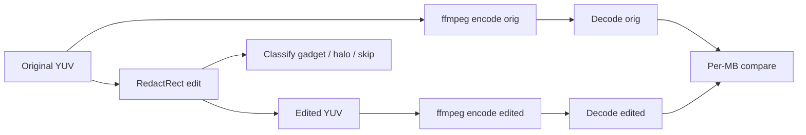

# 720p edit walkthrough — start to finish

End-to-end account of the default neighbor experiment: source clip, synthetic redact edit, which macroblocks are touched, and which macroblocks **change after re-encode** even though their **pre-encode YUV pixels were not painted**.

**Interactive visualization:** open [`720p-edit-walkthrough.canvas.tsx`](/Users/miha/.cursor/projects/Users-miha-projects-fightfake-projects-eva-miha/canvases/720p-edit-walkthrough.canvas.tsx) beside chat.

**Machine-readable MB lists:** `docs/results/mb-walkthrough-720p-intra.json` and `docs/results/mb-walkthrough-720p-gop8.json` (regenerate with `mb_walkthrough_export`).

---

## 1. Source video

| Field | Value |
|-------|--------|
| **Name** | FileSamples `sample_1280x720.mp4` |
| **URL** | https://filesamples.com/samples/video/mp4/sample_1280x720.mp4 |
| **Resolution** | 1280×720 (HD) |
| **Pixel format** | YUV 4:2:0 planar (`yuv420p`) |
| **Frames used** | 30 (first 30 frames of the clip) |
| **Local raw file** | `docs/fixtures/sample_720p_30f.yuv` (~40 MB, gitignored) |
| **Fetch script** | `./scripts/fetch_fixture_720p.sh` |

This is ordinary H.264 test footage — not the Eva Foreman CIF benchmark. It stands in for “real” HD video while keeping experiments reproducible.

**Watch it:**

```bash
# MP4 (browser or any player)
curl -fsSL -o /tmp/sample_1280x720.mp4 \
  "https://filesamples.com/samples/video/mp4/sample_1280x720.mp4"
open /tmp/sample_1280x720.mp4

# Raw YUV (needs size + format)
ffplay -f rawvideo -pix_fmt yuv420p -s 1280x720 docs/fixtures/sample_720p_30f.yuv
```

---

## 2. Pipeline (what happens in order)



1. Load **original** planar YUV (`sample_720p_30f.yuv`).
2. Apply **rectangle redact** on two mid-clip frames → **edited** YUV.
3. Classify every 16×16 **macroblock slot** (MB × frame) as gadget, halo, or skip.
4. **Independently** re-encode original and edited with ffmpeg `libx264` (`-preset ultrafast`, `-qp 23`, `-bf 0`).
5. Decode both bitstreams back to YUV.
6. For each MB, compare decoded luma: flag slots where decode differs but **pixel edit did not paint that MB**.

Steps 4–6 compare **JM syntax** (`pred_y_enc`, `coeff_y_enc`, `type_enc`) and optionally **ffmpeg decode smear** (upper bound only).

---

## 3. The edit

We simulate a privacy redaction: paint a centered rectangle **black** on two frames.

| Parameter | Value |
|-----------|--------|
| **Operation** | `RedactRect` — axis-aligned box fill |
| **Frames** | **14 and 15** only (`frame_start=14`, `frame_end=16`, exclusive end) |
| **Pixel box** | origin **(320, 180)**, size **640×360** px (center half of frame) |
| **Luma fill** | Y = **0** (black) |
| **Chroma fill** | U = V = **128** (neutral → black on display) |
| **Outside box** | Unchanged on those frames |
| **All other frames** | Identical to original |

Implementation: `native_redact_edit_macroblocks` in `video/src/edit/native_macroblocks.rs`, orchestrated by `redact_yuv` in `video/src/neighbor_experiment.rs`.

**Geometric island** (for glue protocol, not the pixel edit itself):

| Region | Meaning |
|--------|---------|
| **Gadget G** | MB overlaps redact box on frames 14–15 |
| **Halo H** | Chebyshev distance ≤ **1** MB from any gadget, same frames, not gadget |
| **Island I** | G ∪ H (must re-encode in Nova) |
| **Skip J** | Everything else (copy captured syntax) |

---

## 4. Macroblock grid conventions

- Frame size **1280×720** → **80×45 = 3600** luma macroblocks per frame.
- MB index **(mb_x, mb_y)** — column/row in the grid; **0-based**.
- Pixel origin of MB **(mb_x, mb_y)** is **(mb_x×16, mb_y×16)**.
- Global clip has **30 × 3600 = 108 000** MB slots total.

---

## 5. Which macroblocks the edit touched (pixel level)

### Gadget — pixels actually painted

Only **gadget** MBs have different YUV **before** any re-encode. This is the exact pixel edit footprint.

| | Frame 14 | Frame 15 | Both frames |
|---|----------|----------|-------------|
| **Gadget MB count** | 920 | 920 | **1840** |

**MB index ranges (inclusive):**

- **mb_x:** 20 … 59 (40 columns)
- **mb_y:** 11 … 33 (23 rows)
- **Pixel coverage:** x ∈ [320, 960), y ∈ [176, 544) — matches the 640×360 box (partial MBs at edges are included if they overlap the box).

Equivalently: every MB whose 16×16 block intersects the rectangle on frames 14 or 15.

**Verification:** `pixel_outside_i = 0` in the experiment matrix — no MB outside island **I** has a pixel change from redact alone.

Full coordinate list: `gadget_mbs` array in `docs/results/mb-walkthrough-720p-intra.json` (1840 entries).

### Halo — in island I but pixels unchanged

Chebyshev **halo_mbs = 1** ring around the gadget on the same two frames. Pixels are **identity**; the MB is in **I** because intra prediction / deblocking can still force a re-encode.

| | Per edited frame | Both frames |
|---|------------------|-------------|
| **Halo MB count** | 130 | **260** |

Halo surrounds the 40×23 gadget block (top, bottom, left, right, and corners one MB out). Full list: `halo_mbs` in the walkthrough JSON.

### Island I summary

| Region | MB slots (frames 14–15) | Share of full clip |
|--------|-------------------------|-------------------|
| Gadget | 1840 | 1.70% |
| Halo | 260 | 0.24% |
| **Island I** | **2100** | **1.94%** |
| Skip J | 105 900 | 98.06% |

---

## 6. Syntax diff: macroblocks that changed without a pixel edit

This is the **correct** metric for glue / Eva: compare paired **JM encoder dumps** on original vs edited YUV.

**Measurement (`syntax_mb_changed`):**

- JM encode **original** YUV → `pred_y_enc`, `coeff_y_enc`, `type_enc`
- JM encode **edited** YUV → same three files
- For each MB slot: syntax changed if **any** of predictor luma, quantized luma coeffs, or 6-byte `type_enc` differ byte-wise
- **Syntax smear** = `syntax_changed ∧ ¬pixel_edited`

JM settings: Main profile, IPPP (`NumberBFrames=0`), QP I/P = 28/30 (via `scripts/jm_syntax_dumps.sh`).

### Results (720p center redact, frames 14–15)

| Category | Syntax (JM) | Decode smear (ffmpeg GOP=1) |
|----------|-------------|----------------------------|
| Changed without pixel edit (all roles) | **73 189** | 382 |
| In **halo** only | **238** | 124 |
| **Outside island I** | **72 951** | 258 |

Syntax smear is much larger than decode smear because **full JM re-encode** rewrites prediction + coefficients on almost every MB when any part of the frame changed — even when local pixels are identical. That is exactly why glue **copies skip syntax** instead of re-encoding the whole clip.

Lists: `syntax_no_pixel_mbs`, `syntax_halo_no_pixel_mbs`, `syntax_no_pixel_outside_i_mbs` in `docs/results/mb-walkthrough-720p-intra-syntax.json`.

Dumps: `docs/fixtures/jm-dumps-720p/orig/` and `.../edited/` (~56 MB each, gitignored).

---

## 7. Decode smear (ffmpeg proxy — not syntax)

This answers: *after ffmpeg re-encodes original vs edited, where does **decoded luma** differ even though we did not paint that macroblock?*

Useful as an **upper-bound sanity check**, not as the glue footprint.

**Measurement:**

- Encode **original** YUV → decode → `dec_orig`
- Encode **edited** YUV → decode → `dec_edit`
- For each MB: `decode_changed = (dec_orig ≠ dec_edit)` on luma (threshold ΔY > 0)
- **Decode smear** = `decode_changed ∧ ¬pixel_edited`

### GOP = 1 (all-intra re-encode)

| Category | Count (frames 14–15) | Notes |
|----------|----------------------|--------|
| Decode smear (all roles) | **382** | 185 on f14, 197 on f15 |
| Decode smear in **halo** only | **124** | Expected: halo pixels unchanged, syntax may shift |
| Decode smear **outside island I** | **258** | Skip MBs on edited frames — encoder non-locality |
| Decode smear on **pre/post** frames | 0 | Mid-clip edit; no temporal post leak in this window |

Lists: `decode_no_pixel_mbs`, `decode_halo_no_pixel_mbs`, `decode_no_pixel_outside_i_mbs` in the JSON.

### GOP = 8 (short GOP)

| Category | Count |
|----------|-------|
| Decode smear (all) | **32** |
| Outside island I | **9** |

---

## 8. Visual guide (canvas layers)

Open the walkthrough canvas and use:

| Layer | Shows |
|-------|--------|
| **Pixel edit** | Red = gadget (920 MBs/frame) |
| **Island I/J** | Red = gadget, amber = halo, gray = skip |
| **Syntax smear** | Purple = JM pred/coeff/type changed, pixel not painted |
| **Decode smear** | Accent = decode changed, pixel not painted (toggle GOP=1 vs GOP=8) |

Frame **14** is the default view — largest smear ring on the right/bottom of the black box under GOP=1.

---

## 9. Reproduce the numbers

```bash
# Fixture (once)
./scripts/fetch_fixture_720p.sh

# JM syntax dumps + walkthrough JSON (includes syntax + decode layers)
cargo run --release -p video --example mb_walkthrough_export -- \
  --gop 1 --out docs/results/mb-walkthrough-720p-intra-syntax.json

# Or dumps only:
./scripts/jm_syntax_dumps.sh --yuv docs/fixtures/sample_720p_30f.yuv \
  --out docs/fixtures/jm-dumps-720p/orig --width 1280 --height 720 --frames 30

# Grid JSON with syntax layer for canvas
cargo run --release -p video --example mb_grid_export -- \
  --syntax-orig-dir docs/fixtures/jm-dumps-720p/orig \
  --syntax-edit-dir docs/fixtures/jm-dumps-720p/edited \
  --out docs/results/mb-grid-720p-syntax.json

# Decode-only walkthrough (no JM):
cargo run --release -p video --example mb_walkthrough_export -- \
  --skip-jm --gop 8 --out docs/results/mb-walkthrough-720p-gop8.json

# Summary CSV (matrix scenarios)
cargo run --release -p video --example experiment_matrix -- \
  --out docs/results/neighbor-matrix-720p.csv
```

---

## 10. Takeaways for the glue protocol

1. **Pixel edit is strictly local** — only **1840** gadget slots change YUV; nothing outside **I** at the pixel layer.
2. **Island I is 2100 slots (1.94%)** — gadget plus one-MB Chebyshev halo on two frames.
3. **Full JM re-encode smears almost the whole clip** — **72 951** skip slots on edited frames have different syntax despite unchanged pixels. Glue must **copy syntax for J**, not re-encode everything.
4. **Syntax smear ≫ decode smear** (73 189 vs 382 under comparable “re-encode everything” tests) — ffmpeg decode diff is a weak proxy; use JM `pred`/`coeff`/`type` diff.
5. **Halo syntax smear (238 slots)** is the region geometry already expects to re-encode; most off-island syntax drift is encoder non-locality on skip tiles.

---

## Related files

| Path | Role |
|------|------|
| `docs/fixtures/README.md` | Fixture download |
| `docs/glue-neighbor-experiments.md` | Glue protocol + experiment index |
| `docs/island-only-proving.md` | Problem statement, encoder sweep, open gaps, next steps |
| `scripts/jm_syntax_dumps.sh` | JM → syntax dump files |
| `third_party/jm-eva/` | JM dump hook source |
| `video/src/mb_grid.rs` | Grid + walkthrough JSON builder |
| `canvases/macroblock-grid.canvas.tsx` | General MB grid explorer |
