# Can the untouched parts of an edited video stay bit-for-bit the camera’s picture?

**Short answer: yes, and it is measured, not argued.**

An editor blacks out a small rectangle on one frame of a 720p clip. We then rebuild a playable
H.264 file in which **every macroblock outside that rectangle decodes to exactly the camera’s
pixels** — every Y, U and V byte. Across ten configurations (8 and 30 frames, one to five
reference frames, fixed quality and rate-controlled capture, three quality levels, four edit
shapes) we have now checked **1,000,225 macroblocks outside the edit and found 0 that differ**.
Two independent decoders (ffmpeg and the ITU reference decoder) produce the same bytes. The
published file is **1.04× to 2.84×** the size of the camera’s original.

That result needs one setting on the capture side: the camera encodes with the **in-loop
deblocking filter switched off**. On this clip that setting costs nothing measurable (36.48 dB
vs 36.46 dB, file size within 0.01%). If the camera leaves the filter on, the result is
*almost* exact: everything matches except a thin ring of **54 macroblocks** hugging the
rewritten area, in which **349 luma samples differ by at most 3 levels out of 255**. That ring
is irreducible — we tried six rounds to close it and it never reaches zero.

This also works on a file we did not encode. Instrumenting a decoder recovers a camera’s
per-macroblock decisions straight from an existing `.264`, and an **x264** capture published
through that route came out exact as well: 7,175 of 7,175 macroblocks outside the edit identical
to x264’s own samples (section 12.1).

So the project works. The rest of this document explains what the problem was, which tricks
solved it, and where the honest limits are.

---

## 1. What we are trying to do

Three parties, one picture.

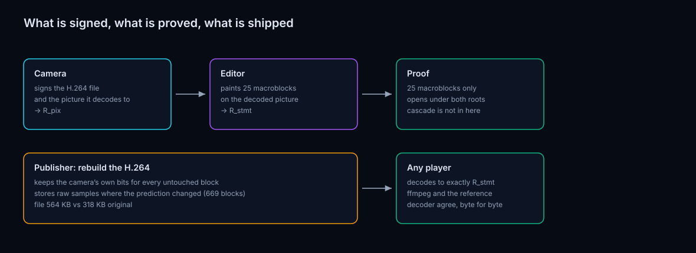

1. **The camera** records a clip and signs two things: the H.264 file, and the picture you
   get by decoding it.
2. **An editor** needs to black out part of that picture — a face, a licence plate, a screen.
3. **A viewer** gets a normal `.mp4` and plays it in a normal player.

Here is the actual before and after, cropped around the edit — the camera’s frame on the left,
the published frame on the right:

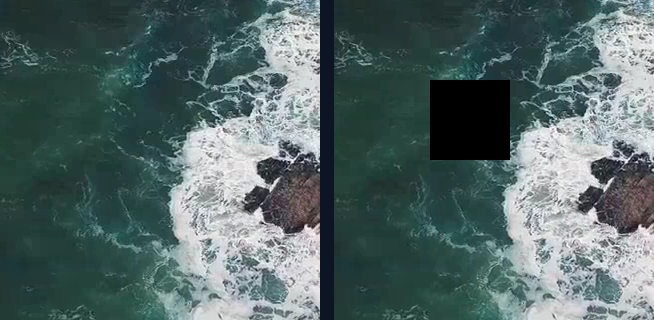

The promise we want to make to the viewer is narrow and strong:

> Everything you see is the camera’s picture, pixel for pixel, apart from the rectangle that
> was blacked out — and there is a cryptographic proof of exactly that.

The proof part is a separate machine (a zero-knowledge proof over the picture). This document
is only about the **pixels**: can we build a playable file where the untouched parts are
bit-for-bit identical to what the camera recorded?

We call the set of blocks that are *allowed* to differ the **island**. The goal is to make the
island as small and as well-defined as possible.

---

## 2. What a video file actually stores

A 720p frame is not stored as 921,600 pixels. It is stored as a grid of **macroblocks**: small
16×16 squares. A 1280×720 frame is 80 across and 45 down — **3,600 macroblocks**. Our 8-frame
test clip is 28,800 of them; the 30-frame clip is 108,000.

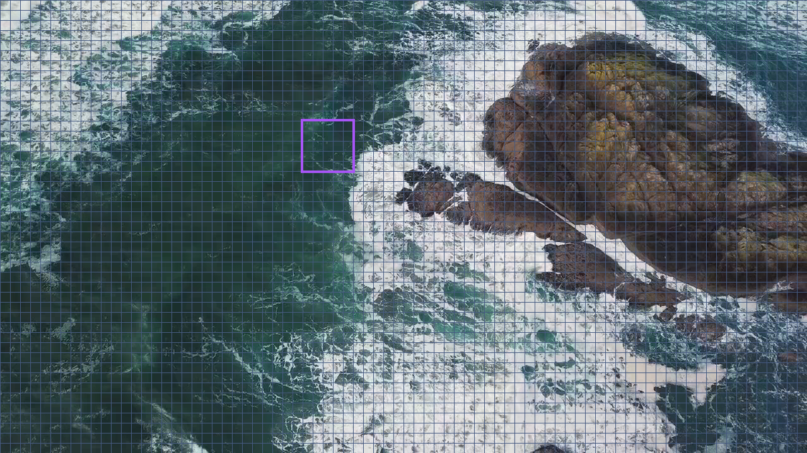

The purple box is the edit: 5×5 = **25 macroblocks**, an 80×80 pixel patch.

Crucially, a macroblock is **not** stored as its 384 bytes of colour. It is stored as a recipe:

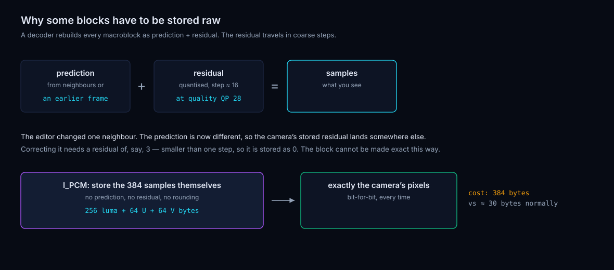

- a **prediction** — "this block looks like the pixels just to my left", or "like this patch
  from the previous frame, shifted 3 pixels right";
- a **residual** — a small correction added on top.

The residual is stored in coarse steps. At normal quality, the step is around 16 levels. A
correction of 3 rounds to zero and vanishes. This is what makes the whole problem hard, and it
is the reason one particular trick is unavoidable.

---

## 3. The deblocking filter, and what “in-loop” means

This one piece of vocabulary comes up constantly below, so it is worth getting straight before
anything else.

A **filter**, in image processing, is a rule that produces each output pixel from a small
neighbourhood of input pixels. A blur filter replaces each pixel with an average of itself and
its neighbours. A sharpen filter does the opposite. Nothing mysterious: a filter is arithmetic
applied over a sliding window.

The filter H.264 cares about here is the **deblocking filter**, also called the smoothing
filter. It exists because of the grid in section 2. Each macroblock is coded independently
enough that neighbouring blocks land on slightly different brightnesses, and the eye is very
good at spotting a straight edge at a 16-pixel interval. So after a frame is rebuilt, the
decoder walks every block border and gently blends the few pixels on either side of it, which
makes the seams disappear. It is a directional blur applied only at block borders, only a few
pixels deep.

**In-loop** is the important part. The filter is not a cosmetic pass applied at display time
and then discarded. Its output is written back into the picture that the codec keeps as a
**reference frame** for the frames that come next. So the filter sits *inside* the coding loop:

```
decode block → add residual → rebuild picture → deblock → store as reference → next frame predicts from it
```

Two consequences follow, and they run through the whole document:

1. The deblocked picture **is** the picture. It is what a viewer sees, and it is what the
   camera signs. Our target is the picture after filtering, never before.
2. Anything the filter does propagates. A frame two seconds later predicts from a picture the
   filter touched.

The filter can be switched off, per clip, by a flag in the encoder. Section 10 is about what
happens when the camera does that, and what it costs.

---

## 4. Why the obvious approach fails

The obvious approach: decode the camera’s video to pixels, paint the box, re-encode.

The re-encoder makes fresh decisions everywhere. It picks different predictions, different
motion vectors, different residuals — across the whole frame, on every frame. The result looks
similar to the camera’s picture and is **different from it almost everywhere**. There is nothing
left to point at and say "this part is untouched".

We measured this route earlier: with a normal re-encode of the cascade, the file gets small
(4% over the original) and only **5 of 25** edited blocks even land on the right colour, with
injected blocks drifting by up to 59 levels. That path is closed.

---

## 5. Trick 1 — do not re-encode; re-emit the camera’s own decisions

### What the trick is

Instead of *deciding* what each macroblock should be, we **copy the camera’s decision and
re-emit it**. For every macroblock we take the camera’s original recipe — its block type, its
motion vectors, its intra prediction modes, its quantiser, its residual coefficients — and hand
those exact values to the bitstream writer. The writer re-encodes them into a fresh file. No
search, no mode decision, no quantisation; just "write these numbers again".

By **the camera’s own decisions** we mean the *syntax* of the camera’s H.264 file: the list of
numbers the camera chose for each block, which is exactly what a decoder reads out of the file
and what fully determines the picture. Those numbers live in small side files, one fixed-size
record per macroblock (`pred_y_enc`, `coeff_y_enc`, `type_enc`, `mv_enc` and friends). The
publishing encoder reads them back, macroblock by macroblock, and stuffs them into its own
internal state before calling the bitstream writer.

There are two ways to produce those side files, and both now work:

- **From the encoder.** The camera-side encoder writes them as it encodes
  (`scripts/jm_syntax_dumps.sh`). This is what every measurement in sections 9 through 12 uses.
- **From the bitstream.** An instrumented decoder reads an existing `.264` and writes the same
  records (`scripts/jm_decoder_dumps.sh`). A decoder already recovers every number the writer
  needs, since that is precisely what decoding a macroblock means; the work was matching the
  encoder’s internal layout, particularly its `(level, run)` coefficient pairs. Section 12.1
  reports the check.

The second path is what makes the construction apply to files we did not produce, so "the
camera’s own decisions" means the decisions recorded in the camera’s file, whoever wrote it.

### Is the edit involved? Is this really a trick?

Both questions are fair, and the answer is that Trick 1 has two faces.

It is a **mechanism**, and the edit absolutely uses it. In the real publishing path, the great
majority of macroblocks — everything the edit did not disturb, 2,931 out of 3,600 on the edited
frame, and every block on every untouched frame — is written by re-emission. That is what makes
"untouched" mean something: those blocks are not approximations of the camera’s blocks, they
*are* the camera’s blocks, re-serialised.

It is also an **experiment**, and that is how we know the mechanism is sound. Run a clip with
**no edit at all** through the whole machinery: read every camera decision, re-emit every one,
write a new file. The output is **byte-identical** to the camera’s file. Not "visually
identical" — the same bytes, all 325,642 of them. We call this the *control run*, and we repeat
it for every configuration in the sweep in section 12; it passed in all ten that ran.

The control run is what licenses every later claim. Because a no-edit pass changes nothing, any
difference we see after an edit is caused by the edit, not by our tooling drifting.

---

## 6. Trick 2 — raw blocks where the prediction changed

Now paint the box and re-emit everything else. The blocks right next to the box break, and here
is exactly why.

A block whose prediction says "copy the pixels to my left" now copies **black**. Its stored
residual was measured against the camera’s pixels, so adding it to a black prediction gives
the wrong answer. Fixing it would need a residual of, say, 3 — smaller than one quantiser step,
so it is stored as 0. **An ordinary residual cannot repair that block.**

H.264 has an escape hatch, and yes, **raw means `I_PCM`** — the standard’s name for a
macroblock stored as its 384 raw samples (256 luma bytes plus 2×64 chroma bytes) with no
prediction and no residual at all. The decoder copies those bytes straight into the picture.
Exactness is guaranteed by construction, and it costs 384 bytes where a normal block costs
around 30.

So the rule is: **re-emit every macroblock in the file; then, wherever the rebuilt block fails
to match its target, switch that one block to `I_PCM` and try again.** "Everywhere" in the
earlier phrasing meant *every macroblock of every frame*, including the frames nobody edited —
we never fall back to encoding anything. Repeat until nothing mismatches. The set of blocks
that ended up raw is the price of the edit.

Here is that set, measured, on the edited frame:

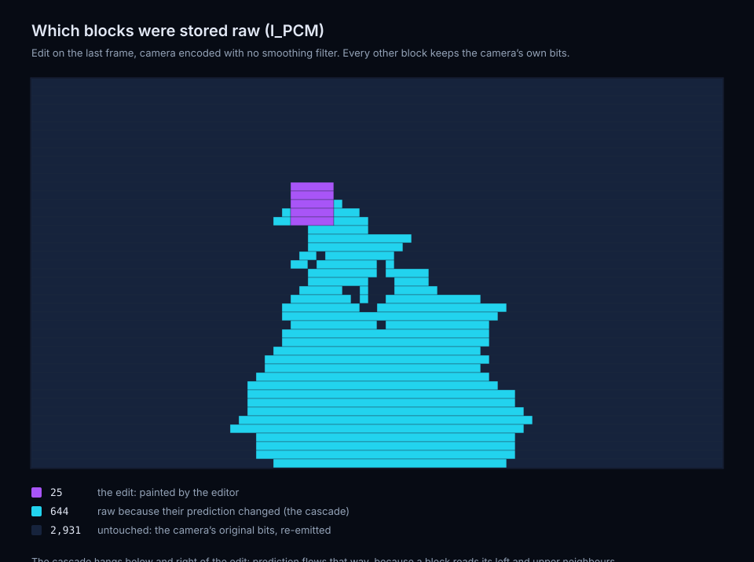

Purple is the 25 blocks the editor painted. Cyan is the 644 further blocks that had to become
raw. The dark 2,931 kept the camera’s own bits. Note the shape: the cyan region hangs *below
and to the right* of the edit, because prediction in H.264 flows that way — a block reads its
left and upper neighbours, never its right or lower ones.

---

## 7. The cascade and the climb — why 25 edited blocks force hundreds

Storing one block raw disturbs its neighbours in three distinct ways.

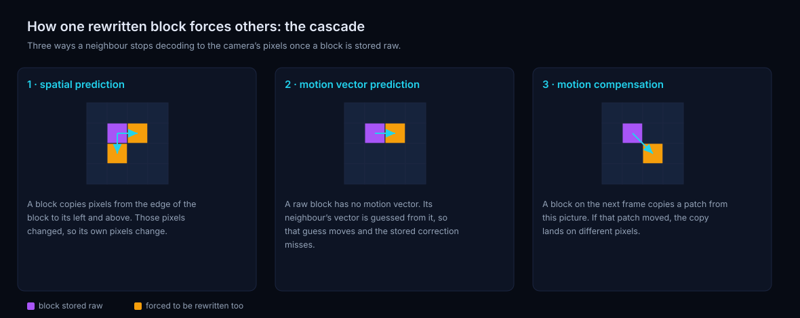

1. **Spatial prediction.** A block that copies pixels from its left or top edge now reads
   different pixels.
2. **Motion-vector prediction.** A raw block carries no motion vector, so its neighbour’s
   *guessed* vector shifts and the neighbour’s stored correction lands in the wrong place.
3. **Motion compensation.** A block on the *next* frame copies a patch from this picture. If
   that patch changed, the copy lands on different pixels.

Reasons 2 and 3 need the vocabulary spelled out.

### What a motion vector is

Most of a video is the previous frame, slightly moved. So instead of describing a block from
scratch, H.264 describes it as *"the same thing, over there"*: take a 16×16 patch out of an
already-decoded frame, at an offset from where this block sits, and copy it. That offset, two
numbers in pixels, is the **motion vector**.

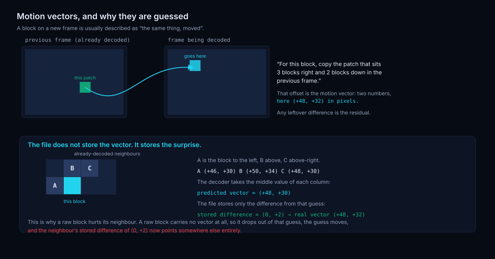

A vector of `(+48, +32)` means "the patch that sits 48 pixels right and 32 pixels down in the
previous frame". A static background gives `(0, 0)`. A car crossing the frame gives a large
horizontal vector. Whatever the copy gets wrong is then fixed by the residual.

### What motion-vector *prediction* is

Vectors are expensive to store and highly redundant: neighbouring blocks in a moving scene
almost always move together. So the file does not store the vector. It stores **only how much
the vector differs from a guess both sides can compute**, and that guess is the
**predicted motion vector**.

The guess is mechanical. Look at three already-decoded neighbours — A to the left, B above, C
above-right — and take the median of their vectors, component by component. In the example in
the figure, with A `(+46, +30)`, B `(+50, +34)` and C `(+48, +30)`, the median is `(+48, +30)`.
The real vector is `(+48, +32)`, so the file stores `(0, +2)`. The decoder recomputes the same
median from the same neighbours, adds `(0, +2)`, and lands on the same vector.

This is where a raw block hurts. **A raw block has no motion vector** — it is not predicted
from anywhere, so nothing goes into the median. The neighbour’s guess is computed from a
different set of values, so the guess moves, and the neighbour’s stored `(0, +2)` now points
somewhere else entirely. Its copy lands on the wrong pixels. That neighbour must be rewritten
too.

### Cascade versus climb

Each disturbed neighbour that gets rewritten disturbs *its* neighbours, and so on.

- The **cascade** is the transitive closure of that, *within one frame*: every block that has
  to go raw so that the rest of the frame can keep the camera’s pixels. It is the cyan region
  in the figure in section 6 — 644 blocks for a 25-block edit.
- The **climb** is the same effect *across time*. It is reason 3 above: frame 8 copies patches
  out of frame 7. If frame 7’s pixels changed, those copies change, so blocks on frame 8 must
  go raw as well — and then frame 9 predicts from a rewritten frame 8. The cascade climbs
  forward through the clip, one frame at a time.

The cascade is bounded by the frame. The climb, left unchecked, is bounded only by the end of
the clip, and section 10 shows it running away exactly like that. Killing the climb is the main
reason the filter-off capture setting matters.

---

## 8. Trick 3 — the bug that made two decoders disagree

Worth calling out in detail, because without this fix nothing above works.

### What broke

H.264 uses CABAC, an arithmetic coder that compresses each number using the *neighbouring*
numbers as context: to write one block’s motion-vector difference, the coder first looks at
what the neighbouring blocks’ motion-vector differences were, and picks its probability model
accordingly. The decoder does the same lookup on its side. Writer and reader must hold
**identical** context, always, or the two sides desynchronise and every bit after that point is
garbage.

The field was `currMB->mvd`, the macroblock’s array of motion-vector differences.

The encoder in question is **ours** — the publishing encoder, the modified JM reference encoder
that performs the injection. Here is how it happened. Our code takes a macroblock that has
already been set up as a normal predicted block (with real motion vectors and a real `mvd`
array sitting in its state) and converts it in place into a raw block: it overwrites the block
type, copies the 384 samples in, clears the residual. What it did *not* do was clear `mvd`. So
the encoder walked on holding the stale motion-vector difference of the block it had just
replaced, while every decoder in the world — following the standard, which says a raw block has
no motion-vector difference — stored zero there.

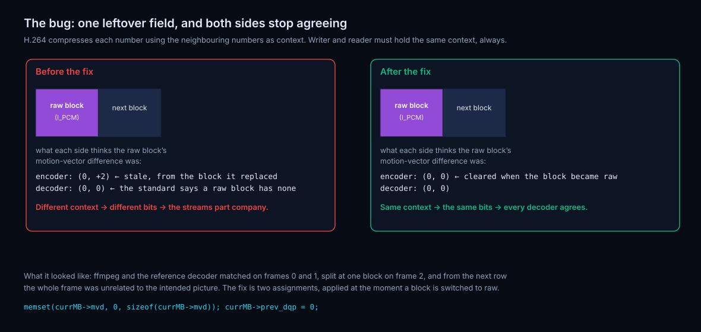

The next block in raster order then asked "what was my neighbour’s motion-vector difference?"
and got `(0, +2)` on the encoder and `(0, 0)` on the decoder. Different context, different
probability model, different bits.

### What it looked like

The symptom was maddeningly non-local. ffmpeg and the ITU reference decoder agreed with each
other and with us on frames 0 and 1. On frame 2 they split at exactly one motion-compensated
block. From the next macroblock row onward the whole frame was unrelated to the intended
picture — because once the arithmetic decoder is off by one bit, it is off forever.

### How the fix works

Two assignments, applied at the moment a block is switched to raw, in
`third_party/jm-eva/eva_glue.c`:

```c
/* A raw block has no motion-vector difference. The next block's arithmetic
 * coder uses the neighbour difference as context; the decoder stores 0. */
memset(currMB->mvd, 0, sizeof(currMB->mvd));
currMB->prev_dqp = 0;
```

The first line zeroes the whole `mvd` array, so our context matches what a decoder will store.
The second does the same job for the quantiser: `prev_dqp` is the *change* in quantiser
relative to the previous block, and it is also used as CABAC context. A raw block carries no
quantiser change, so it must be zero on our side too.

After the fix, both decoders finish every frame and agree with each other and with the intended
picture, byte for byte.

---

## 9. Result with the camera’s deblocking filter left on

Recall from section 3 that the camera’s signed picture is the picture **after** filtering.

Here is what the published frame looks like, block by block, from real measured data:

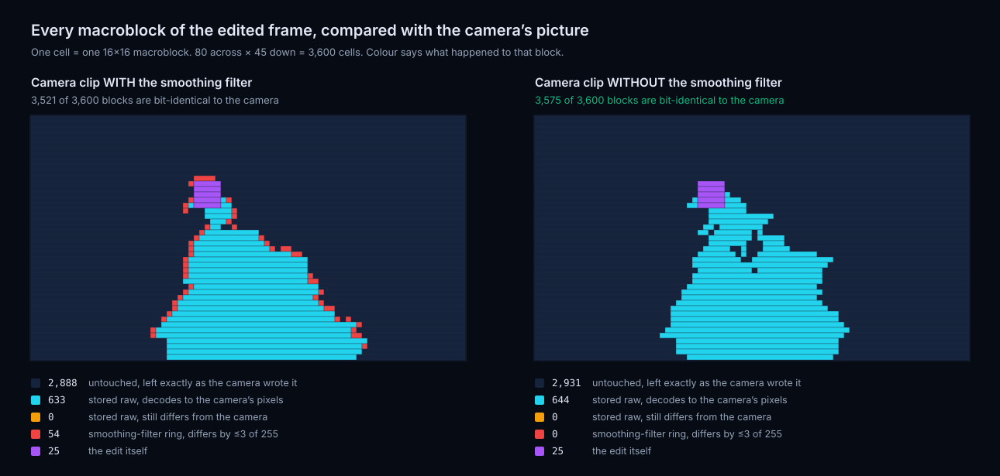

### How to read that figure

Each panel is one frame drawn as a grid: **one cell is one 16×16 macroblock**, laid out in the
position it occupies in the picture, 80 across by 45 down, 3,600 cells. The colour of a cell
says what happened to that block. Nothing here is a schematic — every cell was computed by
decoding both files and comparing bytes:

- decode the camera’s file to raw YUV, decode the published file to raw YUV;
- for each macroblock, compare all 384 bytes (256 luma, 2×64 chroma) between the two;
- read the publishing encoder’s log of which blocks it stored raw.

That gives five classes, and each panel carries its own key with the counts, so:

| Colour | Meaning |
|---|---|
| Dark | untouched — the camera’s own bits, re-emitted, decoding identically |
| Cyan | stored raw, and decodes to exactly the camera’s pixels |
| Orange | stored raw and *still* differs from the camera — this count is 0 in both panels |
| Red | differs from the camera and was not stored raw: the deblocking ring |
| Purple | the 25 blocks the editor painted, the only blocks allowed to differ |

The left panel is the camera clip **with** the filter: 3,521 of 3,600 blocks are bit-identical,
including all 633 raw ones. The right panel is the same edit on a clip captured **without** the
filter: 3,575 of 3,600, and the red class is empty. The 25 purple cells are the edit in both.

The cyan region is worth pausing on. Those blocks were rewritten from scratch and they still
land on exactly the camera’s pixels — that is Trick 2 working.

What remains in the left panel is the red outline: **54 macroblocks**.

### Why the ring exists

Those 54 are the **deblocking ring**, and the cause is a specific rule in the standard.

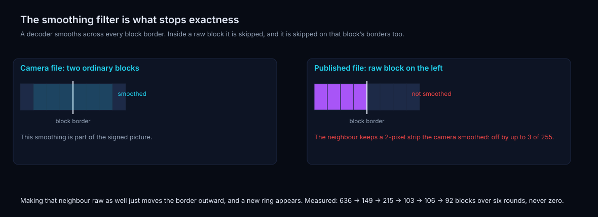

The strength of the filter at any border is set by the **average of the quality numbers (QP) of
the two blocks** on either side. The standard fixes a raw block’s QP at **0** for this purpose,
because a raw block has no quantisation error to hide. Our normal blocks sit at QP 28. The
average is 14 — and at 14 both of the filter’s thresholds are zero, which means *no pixel
difference is small enough to qualify for filtering*. The decoder therefore **skips that border
entirely**.

That is a decision the decoder makes, not us, and it is correct behaviour. But it means the
*ordinary* block next to a raw block keeps a couple of pixels that the camera had smoothed and
we cannot smooth, because we do not control the decoder.

Here is that happening on real samples, one row of pixels straddling one border:

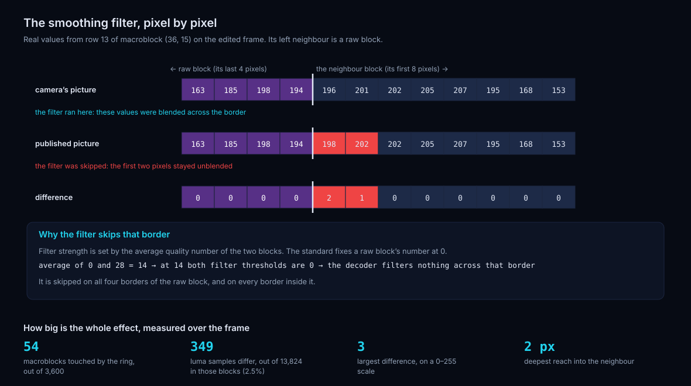

Reading the top two rows: in the camera’s picture the first two pixels past the border are
`196, 201`; in the published picture they are `198, 202`, the unblended values. Everything
deeper into the block is identical, because the filter only ever reaches 3 pixels in and
changes at most 2 here.

Measured over the whole frame, the ring is:

| | |
|---:|---|
| **54** | macroblocks touched, out of 3,600 |
| **349** | luma samples that differ, out of 13,824 in those blocks (2.5%) |
| **3** | largest difference, on a 0–255 scale |
| **18** | chroma samples that differ, largest difference 1 |
| **2 px** | deepest reach into the neighbouring block |

Invisible to the eye, and non-zero. For a cryptographic claim, non-zero is what counts.

A difference map of the whole frame makes the shape plain — the bright square is the edit, the
faint speckle is the ring:

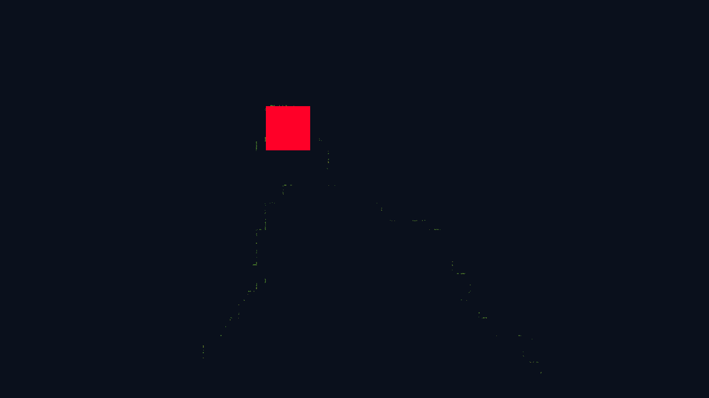

### Trick 4 — give raw blocks the *deblocked* samples

Our first version stored the camera’s pixels *before* deblocking in the raw blocks, so **636**
macroblocks differed from the signed picture. That was simply the wrong target. The filter
never runs inside a raw block — it is skipped on all four of its borders and there are no
borders inside it — so whatever we store in a raw block *is* the final decoded output. It must
therefore be the camera’s **post-filter** samples, the ones that were signed.

So we run the camera’s encode, capture the reconstruction *after* the filter, use that as the
target for the raw blocks, and iterate once to a fixed point:

| | Raw blocks | File | Macroblocks unlike the camera |
|---|---:|---:|---:|
| Storing pre-filter samples | 658 | 560 KB | **636** |
| Storing post-filter samples | 658 | 560 KB | **54** |

Same block count, same file size, and the mismatch set collapses from most of the neighbourhood
to the ring alone.

### The ring cannot be closed

The natural next move is to make those 54 ring blocks raw as well. That fixes them and creates
a *new* ring around them, because the new raw blocks have new ordinary neighbours. Six rounds
of chasing it:

| Round | Raw blocks | File | Macroblocks unlike the camera |
|---:|---:|---:|---:|
| 0 | 658 | 560 KB | 636 |
| 1 | 818 | 619 KB | 149 |
| 2 | 1,055 | 707 KB | 215 |
| 3 | 1,154 | 743 KB | 103 |
| 4 | 1,268 | 784 KB | 106 |
| 5 | 1,381 | 826 KB | 92 |

The cost climbs, the mismatch stalls around a hundred blocks, and it never reaches zero. **With
the filter on, a thin ring is part of the island. That is a structural fact about H.264, not a
bug in our code.**

---

## 10. Trick 5 — the camera encodes with the filter off

The deblocking filter is a per-clip switch in the camera’s encoder (five configuration flags in
JM; one flag in most encoders). Turn it off at capture time and the reconstruction *is* the
picture: there is no smoothing for the decoder to skip, so there is no ring to leave behind.

We rebuilt the whole experiment that way, and the result is clean:

| | Value |
|---|---|
| Macroblocks outside the edit that differ from the camera | **0 of 28,775** |
| Decoded output vs the intended picture | **identical, all 11,059,200 bytes** |
| ffmpeg vs ITU reference decoder | **identical** |
| Decoder errors | none |

### What the difference map shows


This is a **difference map**: the whole edited frame, one image pixel per video pixel, coloured
by how far the published picture is from the camera’s picture at that exact position. Black
means the two files produced the identical byte. Anything non-black means a difference, with
brighter and redder meaning larger (the brightness is amplified about 24× so that a difference
of even one level out of 255 is clearly visible).

Compare it with the filter-on map at the end of section 9, drawn the same way: that one has a
faint halo of speckle around the bright square, which is the 54-block ring. This one has
nothing. Only the edited rectangle differs. Every other pixel in the frame is bit-for-bit the
camera’s.

### It also kills the climb

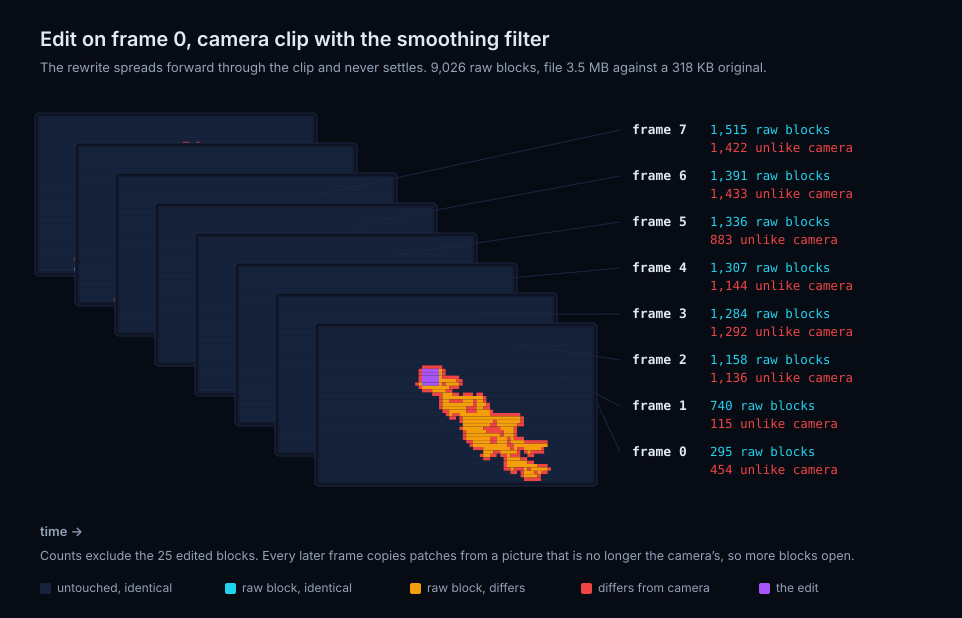

These two figures stack the frames of the clip one above the other, earliest at the top, so you
can watch the rewrite move through time. With the filter on and the edit on the *first* frame,
each frame opens more raw blocks than the last: 295 → 740 → 1,158 → 1,284 → 1,307 → 1,336 →
1,391 → 1,515. It is still rising when the clip ends. Total 9,026 raw blocks, file 3.5 MB
against a 318 KB original. That is the climb from section 7, unchecked.

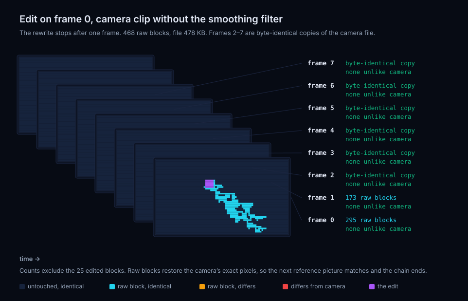

With the filter off, the same edit opens 295 blocks on the painted frame, 173 on the next, and
then **stops**. Frames 2 through 7 are byte-identical copies of the camera’s file. Total 468
raw blocks, file 478 KB.

The mechanism is worth stating plainly. A raw block stores the camera’s exact final pixels, so
the reference picture that the next frame predicts from is *exactly* the camera’s reference
picture. There is nothing left to drift from, and the chain ends. With the filter on the chain
never ends, because the ring means each rewritten frame is *almost* the camera’s picture, and
"almost" is enough to seed a fresh cascade on the following frame.

### What the filter-off setting costs the camera, and why it needs re-measuring

Two encodes of the same source clip at the same quality setting, filter on and filter off:

| Camera encode | Quality (PSNR-Y) | File size |
|---|---:|---:|
| Filter on | 36.46 dB | 325,622 B |
| Filter off | 36.48 dB | 325,642 B |

**"Free" means exactly this:** switching the filter off cost 0.02 dB of measured quality (in
our favour, which is noise at this precision) and 20 bytes out of 325,622, or 0.006%, on file
size. There is no trade here to argue about — on this clip, at this setting, the filter was not
buying anything. A camera vendor could turn it off and nobody would see a difference.

**Why that number cannot simply be assumed to hold.** The deblocking filter exists to hide
quantisation error at block borders, and how much error there is to hide depends entirely on
the clip and the bitrate:

- **Bitrate.** At QP 28 the residual is fine-grained enough that block borders barely step, so
  there is little for the filter to do. At QP 38 on a low-bitrate stream, blocks step visibly
  and the filter is doing real work; switching it off there can cost a full dB and look blocky.
  Our measurement is at one operating point.
- **Content.** Flat gradients (sky, walls, skin) are where blocking artefacts show worst, and
  our clip is textured and in motion, which hides them. A static interview shot against a plain
  wall is the hard case.
- **Resolution and viewing size.** The filter reaches a fixed 3 pixels, so its visual weight
  relative to the picture changes with resolution and with how large the video is displayed.
- **Encoder.** Every encoder tunes its filter strength differently, so "off" costs a different
  amount in each one.

None of these is a reason to expect the *construction* to break — exactness does not depend on
image quality. They are reasons why the sentence "this setting is free" is a claim about one
clip at one bitrate, and a camera vendor would want it re-measured on their own capture
profiles before adopting it as a default.

---

## 11. What it costs to publish

Every configuration below is exact: **zero** macroblocks outside the edit differ from the
camera’s picture. The only variable is file size, which is driven by how many blocks had to go
raw — and that depends on where in the clip the edit sits.

| Edit on frame | Raw blocks | Published file | vs 318 KB original |
|---:|---:|---:|---:|
| 0 (first) | 468 | 478 KB | **1.50×** |
| 2 | 1,605 | 902 KB | **2.84×** |
| 4 | 130 | 367 KB | **1.15×** |
| 6 | 1,522 | 873 KB | **2.75×** |
| 7 (last) | 669 | 564 KB | **1.77×** |

Raw-block counts include the 25 edited blocks. The spread between 1.15× and 2.84× is content:
how much of the picture happens to be predicting from the edited region on the following frame.

For scale: the *proof* only ever covers the **25 edited macroblocks**. The hundreds of raw
blocks are a bandwidth cost in the published file, and they never enter the proof.

---

## 12. The configuration sweep

An earlier draft of this document listed longer clips, multiple reference frames,
rate-controlled captures, B-frames and different edit shapes as untested. They have now been
run. Each row is a full end-to-end run: capture the clip, control-replay it, paint the edit,
publish, decode both files with ffmpeg, and compare every macroblock outside the edit.

| Configuration | What it changes | Control byte-identical | Outside the edit | Raw blocks | File vs camera |
|---|---|:-:|---|---:|---:|
| `base-8f-1ref` | the baseline, 8 frames | yes | **0 of 28,775 differ** | 669 | 1.77× |
| `long-30f-1ref` | 30 frames, one GOP | yes | **0 of 107,975 differ** | 242 | 1.10× |
| `refs5-30f` | five reference frames | yes | **0 of 107,975 differ** | 848 | 1.36× |
| `gop8-30f-1ref` | an IDR every 8 frames | yes | **0 of 107,975 differ** | 130 | 1.04× |
| `ratectl-30f-1ref` | rate control at 6 Mbit/s, QP moves per frame | yes | **0 of 107,975 differ** | 163 | 1.08× |
| `qp20-30f-1ref` | higher quality, QP 20 | yes | **0 of 107,975 differ** | 531 | 1.08× |
| `qp34-30f-1ref` | lower quality, QP 34 | yes | **0 of 107,975 differ** | 326 | 1.35× |
| `edit-large-30f` | a 20×14 edit, 280 macroblocks | yes | **0 of 107,720 differ** | 1,108 | 1.47× |
| `edit-strip-30f` | a 70×1 strip, 70 macroblocks | yes | **0 of 107,930 differ** | 1,960 | 1.82× |
| `edit-two-frames-30f` | the same box on two consecutive frames | yes | **0 of 107,950 differ** | 337 | 1.14× |
| `bframes2-30f` | two B-frames between anchors | — | **not run** | — | — |

Ten of eleven configurations are exact, and in every one of those ten the published file also
decodes to precisely the picture the editor asked for, byte for byte. Together they cover
**1,000,225 macroblocks outside the edit, none of which differ from the camera’s**. Raw data:
[`docs/results/exactness-matrix.csv`](results/exactness-matrix.csv); driver:
`scripts/exactness_matrix.py`.

Things the sweep taught us beyond "it holds":

- **Longer clips are cheaper, not more expensive.** The 30-frame run publishes at 1.10× where
  the 8-frame run is at 1.77×, because the raw blocks are a fixed local cost amortised over
  more frames. The climb does not accumulate, and the bitstream shows it exactly: comparing the
  camera’s file with the published file NAL unit by NAL unit, **28 of the 30 coded frames are
  byte-identical**. Only frames 15 (the edited one) and 16 differ at all. Frames 0–14 and 17–29
  are the camera’s own bytes, unchanged.
- **More reference frames widen the reach, not the depth.** With five reference frames the raw
  blocks land on frames 15, 16, 18 and 20 — later frames can still see the edited picture — but
  the total stays modest (848 blocks, 1.36×) and everything outside stays exact.
- **Frequent keyframes are nearly free.** With an IDR every 8 frames, the cascade cannot climb
  past the next keyframe, and the edit costs 130 blocks and 1.04×.
- **Rate-controlled capture needed a real fix.** A rate-controlled encode moves the quantiser
  per frame, and the replay has no rate controller to rediscover those values from a picture it
  is not encoding. The control run came out 55 bytes larger and the publish drifted from frame
  3 onward. The fix is for the replay to take the slice-header QP from the camera’s dumps
  rather than recomputing it (`eva_glue_slice_qp`, one override in `set_slice`). With that in
  place the control run is byte-identical again and the publish is exact.
- **Edit shape matters more than edit size.** A 280-macroblock square costs 1,108 raw blocks;
  a 70-macroblock thin horizontal strip costs 1,960, because a strip has far more perimeter per
  unit area and the cascade grows from the perimeter.

**Why `bframes2-30f` did not run.** This is a limitation of our replay tool, not a result about
the construction. A B-frame predicts from two lists — one earlier picture and one *later* one —
and may inherit its motion implicitly from a co-located block. Our per-macroblock dump format
records list-0 motion only, tags B slices with a placeholder slice kind, and computes reference
indices assuming strictly forward IPPP ordering. Feeding a B macroblock through it reads B
syntax as if it were P syntax, and the encoder crashes on the first B frame. Supporting
B-frames means extending the dump record (list-1 vectors and references, per-partition
prediction direction, the B macroblock type table, direct-mode inheritance) and the injection
path that consumes it. That is real work, and until it is done, the honest statement is that
**B-frames are untested**. They are also the configuration where we would most expect surprises,
because the climb would run backwards in time as well as forwards.

## 12.1 Publishing a file we did not encode

Everything above captures the camera’s syntax from the encoder. That leaves the question of
whether the construction applies to a file produced by something other than our capture path,
which is the case that matters for a real camera.

It does, and the route is a **bitstream reader**: `scripts/jm_decoder_dumps.sh` instruments the
reference decoder so that decoding a `.264` also writes the nine dump files, in the same
fixed-size records the encoder writes (`third_party/jm-eva/eva_decdump.c`). A decoder already
recovers every number the bitstream writer needs — recovering them *is* decoding — so the work
was layout rather than semantics: the encoder keeps residuals as `(level, run)` pairs indexed by
an 8×8 slot and a 4×4 sub-block, while the decoder scatters dequantised values into a
coefficient array, so the capture has to happen at parse time and be re-packed into the
encoder’s indexing.

Two checks, on a 720p clip encoded by **x264** with the deblocking filter off:

- **Round-trip.** Decode the x264 file into dumps, replay those dumps through the publishing
  encoder with no edit, and decode the result. The two pictures are **identical, all 2,764,800
  bytes**, luma and chroma, on both frames.
- **Publish an edit.** Paint a 5×5 macroblock redaction on the second frame and publish.
  **7,175 of 7,175 macroblocks outside the edit decode to exactly x264’s samples**, and the
  published file decodes to exactly the editor’s target picture. The edit cost 25 raw blocks,
  one per painted macroblock, with no cascade: the painted region’s neighbours on that frame are
  inter-coded from the untouched first frame, so nothing else had to be rewritten.

One thing the bitstream carries that per-macroblock dumps do not is the picture-level
`chroma_qp_index_offset`, which lives in the PPS and shifts every chroma quantiser in the file.
x264 writes −2 where our encoder defaults to 0, and until the replay matched it, luma was exact
and essentially every chroma sample was off by a small amount. `--chroma-qp-offset` on
`jm_glue_encode.sh` carries it across. It is the kind of discrepancy this test exists to find:
a picture-level parameter that no amount of per-macroblock agreement will reveal.

Against a JM capture the reader is also checkable field by field, since both dumps exist.
Motion vectors, motion vector differences, intra prediction modes and sub-macroblock partitions
match on **every macroblock of both fixtures**, as do chroma headers, chroma DC and AC, all I16
luma DC, and luma AC. The residual disagreements are all encoder-side buffers holding stale
values from rate-distortion trials that nothing reads back: `type_enc` byte 3 when the
macroblock is not I16, `cofDC` on non-I16 macroblocks, and unused `cofAC` slots on 8×8
macroblocks.

`scripts/compare_dumps.py` does that field-by-field comparison. **Untested** in the reader:
CAVLC streams, B-frames, 4:2:2 and 4:4:4, 10-bit, interlaced coding, and more than one slice per
frame.

---

## 13. How it was verified

Nothing here rests on our own encoder agreeing with itself.

- **Two independent decoders.** ffmpeg and the ITU/ISO reference decoder (`ldecod`) both decode
  the published file, and their outputs are identical to each other and to the intended
  picture, byte for byte across every frame — checked on the 8-frame baseline (11,059,200
  bytes) and on the 30-frame run (41,472,000 bytes).
- **Frame-level bitstream identity.** On the 30-frame run, 28 of the 30 coded frames come out
  as byte-identical NAL units to the camera’s. The edit touches two frames and nothing else.
- **No decoder complaints.** No errors, no illegal-syntax warnings, no concealment.
- **Control run.** An unedited clip through the same machinery comes out byte-identical to the
  camera’s file with zero raw blocks, in all ten configurations that ran. The machinery does
  not perturb anything on its own.
- **Independent checker.** `video/examples/publish_yuv_verify.rs` re-derives everything from the
  two decoded YUV files without trusting the encoder’s logs: 28,775/28,775 untouched blocks
  identical, 25/25 edited blocks matching the editor’s own redaction function, and all 25
  opening correctly under both Merkle roots.

Reproduction:

```bash
# camera clip, filter off, 8 frames, 720p, QP 28, one reference
bash scripts/jm_syntax_dumps.sh --yuv clip8.yuv --out /tmp/cam \
  --width 1280 --height 720 --frames 8 --qp 28 --refs 1 --df-off

# publish an edited clip, exact outside the edit
EVA_GLUE_EXACT=1 EVA_GLUE_IPCMLOG=/tmp/raw.txt \
  bash scripts/jm_glue_encode.sh --glue-dir /tmp/cam --yuv painted.yuv \
  --out /tmp/published.264 --frames 8 --qp 28 --refs 1 --df-off

# check it
cargo run --release -p video --example publish_yuv_verify -- \
  camera.yuv published.yuv /tmp/raw.txt 1280 720 8  480 192 80 80 7 8  16 128 128

# the whole configuration sweep (writes docs/results/exactness-matrix.csv)
python3 scripts/exactness_matrix.py

# publish a file we did not encode: recover its syntax from the bitstream first
bash scripts/jm_decoder_dumps.sh --in x264.264 --out /tmp/cam-from-stream
EVA_GLUE_EXACT=1 EVA_GLUE_IPCMLOG=/tmp/raw.txt \
  bash scripts/jm_glue_encode.sh --glue-dir /tmp/cam-from-stream --yuv painted.yuv \
  --out /tmp/published.264 --frames 2 --qp 28 --refs 1 --df-off --chroma-qp-offset -2

# regenerate the figures in this document
python3 scripts/make_exactness_figures.py
```

---

## 14. Honest limits

**Established.** Exactness outside the edit, with the filter off, on a real 720p clip with
motion: 1,000,225 macroblocks checked across ten configurations, none differing. Verified by
two independent decoders and by a checker that reads only the decoded pixels. The climb is
contained to the edited frame and the one after it. Control runs byte-identical. File cost
1.04×–2.84×.

**Conditional.** The clean result needs the camera to encode with the deblocking filter off. On
this clip that is free; on other content and other bitrates it needs re-measuring, for the
reasons in section 10. With the filter on, the island grows by a 54-block ring in which 349
luma samples differ by at most 3 levels out of 255, and that ring cannot be eliminated.

**Still open.**

- **B-frames**, blocked by our dump format rather than by anything we have measured
  (section 12). This is the gap most likely to hold a surprise.
- **Production encoders beyond x264, and x264 beyond this configuration.** An x264 capture now
  publishes exactly (section 12.1), so the construction is not tied to our capture path. The
  reader itself, though, has only been exercised on CABAC 4:2:0 8-bit progressive streams with
  one slice per frame. CAVLC, 4:2:2, 4:4:4, 10-bit, interlaced coding, multi-slice frames and
  hardware-encoder quirks are all unexercised, and each is a place where a picture-level
  parameter could hide the way `chroma_qp_index_offset` did.
- **Bit-identical republication of a third-party file.** The x264 round-trip reproduces the
  *picture* exactly; the bytes differ, because our encoder writes its own SPS and PPS rather
  than carrying the original across. For exactness outside the edit that does not matter, since
  the claim is about decoded samples. For a publisher who wants the untouched frames to be
  byte-identical NAL units (as they are for our own captures), the parameter sets would have to
  be copied rather than regenerated.

**Deliberately outside this document.** The zero-knowledge proof over the 25 edited blocks, its
cost, and the C2PA plumbing. Those are separate machinery; this document is about whether the
pixels can be made to line up.

---

## 15. Verdict

The approach works.

The untouched parts of an edited video can be made bit-for-bit identical to the camera’s
picture, in a file that plays in any ordinary player, at 1.04× to 2.84× the original size. The
tricks that get there are: re-emit the camera’s own decisions rather than re-encoding; store
raw samples where the prediction changed; clear the leftover motion-vector and quantiser
context on those blocks; store the camera’s *final*, post-filter samples in them; and have the
camera encode with the deblocking filter off, which both removes the last ring of mismatch and
stops the rewrite from spreading through the clip.

There is no reason to abandon it.
