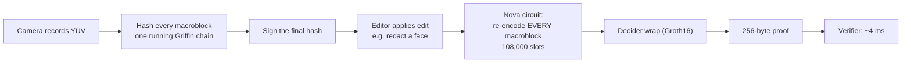
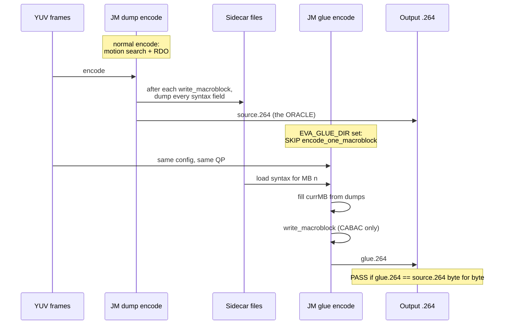
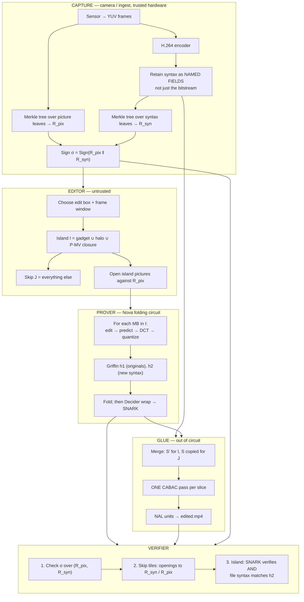
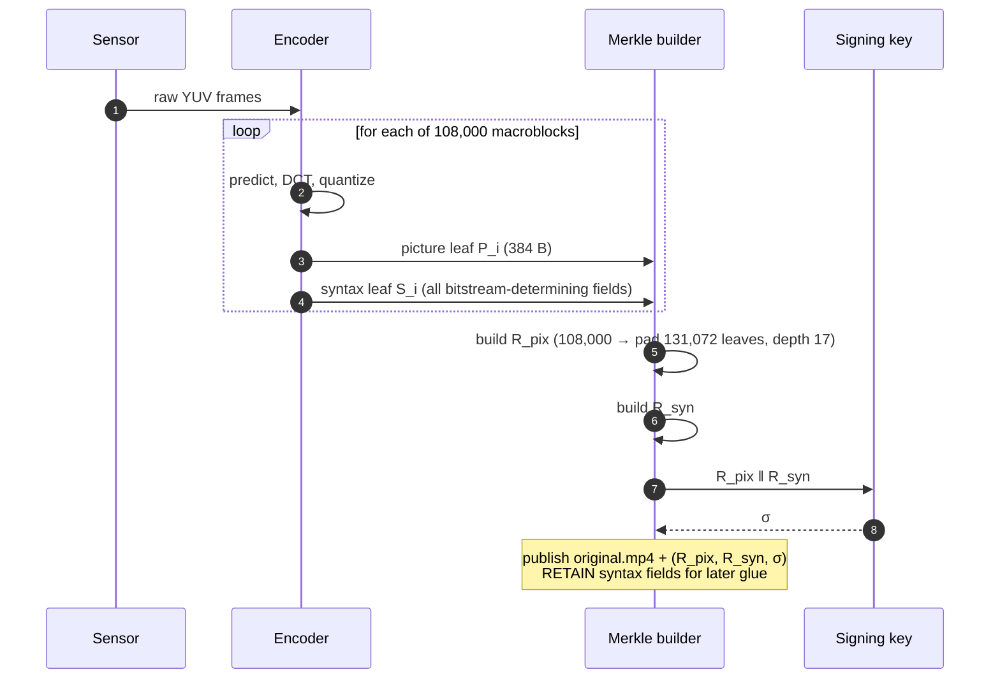
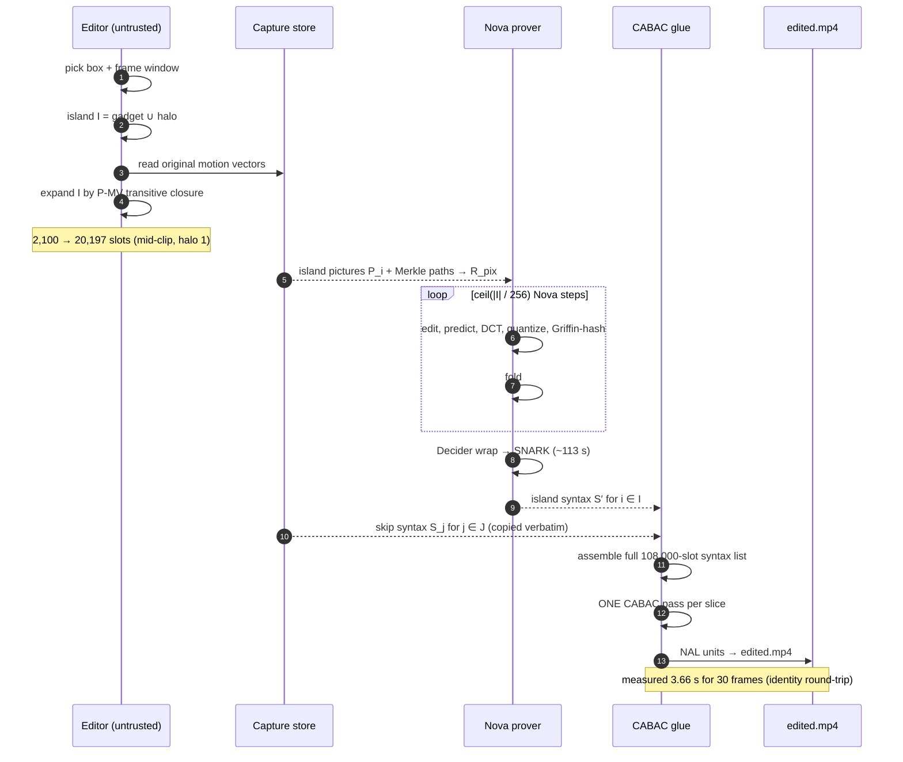
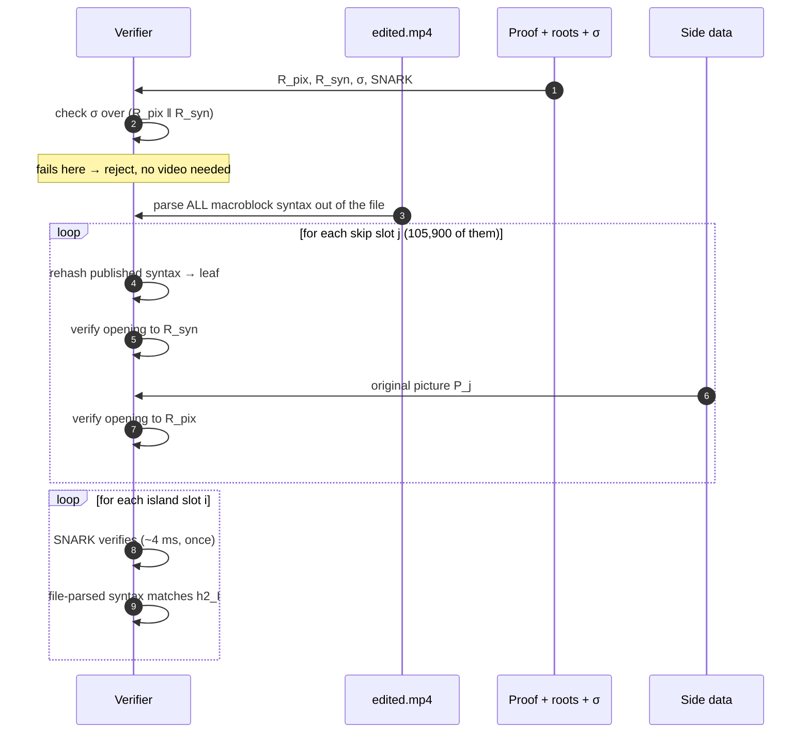

# Island-only Eva, explained from scratch

**Audience:** anyone. No video-coding or SNARK knowledge assumed. Every term is defined before use.

**Purpose:** answer one question honestly — *does the island-only approach work, and what does it
actually cost compared to Eva as it exists today?*

**Companion docs:** [`island-only-proving.md`](island-only-proving.md) (measurement log, next steps),
[`glue-neighbor-experiments.md`](glue-neighbor-experiments.md) (how to run the experiments),
[`720p-edit-walkthrough.md`](720p-edit-walkthrough.md) (one scenario end to end).

**Numbers convention.** Every number is tagged:

| Tag | Meaning |
|---|---|
| **[M]** | Measured in this repo, with a CSV or log behind it |
| **[D]** | Derived arithmetic from measured numbers (formula shown) |
| **[E]** | External estimate or engineering judgement, *not* measured here |
| **[?]** | Not known. Explicitly flagged so nobody quotes an invented figure |

---

# Part 0 — The one-page answer

## What we are trying to do

A camera records a video and cryptographically signs it. Later, someone needs to publish a version
with a face blurred out. Everyone else must be able to check: *"this is the camera's real footage,
and the only change is the declared blur."*

Eva does this today by re-proving **every single block of the video** inside a
zero-knowledge proof. That is slow. The **island-only** idea is to prove **only the blocks that
changed** (about 2% of the video) and copy the other 98% from the signed original.

## Does it work?

| Piece | Status | What that means |
|---|---|---|
| Proving only the edited region is *possible in principle* | **Plausible** | The math has no obvious hole; the pieces exist |
| Copying unchanged syntax is exact at the merge level | **Proven [M]** | Splice-decode spike: 0 difference outside the island |
| Re-assembling a real playable H.264 file from merged fields | **Proven [M]** | This is the CABAC glue work — bitexact through 30 frames |
| The cost saving is 50× | **False [D]** | Real saving is **2.6×–16×**, because of P-MV closure |
| Publishing a genuinely *edited* file end to end | **Runs, but fails [M]** | Mixed bitstream decodes cleanly and is *less* faithful to the camera than a plain re-encode |
| Skip tiles are cryptographically sound | **Broken** | `S ↔ P` binding is unproven; a malicious camera can cheat |
| The commitment covers everything needed | **Broken [M]** | `syntax_leaf` *and* the circuit's `h2` both omit motion vectors, intra modes, MVD — same hole on both sides |
| Merkle openings are affordable | **Only with Griffin trees [M]** | SHA3 in-circuit is **555×** the encode; Griffin open ≈ **1×** encode — see §7.6 |

## The honest summary in five sentences

1. The **engine works**. We can take macroblock-level syntax and produce a bitexact, playable
   H.264 file without re-running the encoder. That was the biggest unknown and it is now closed.
2. The **speedup is much smaller than advertised** — not 50×, but roughly **4.5×** for a mid-clip
   edit, and only **2.6×** if the edit is near the start of the clip.
3. The **security story has a hole** (`S ↔ P`) that Merkle openings do not close.
4. The **commitment format is wrong on both sides** — we now know exactly which fields determine a
   macroblock's bitstream, and neither the camera's `syntax_leaf` nor the circuit's `h2` covers more
   than a subset of them.
5. The **publish path has now been run and it does not work as designed**: a mixed bitstream of
   camera skip tiles plus island tiles from a separate edited encode assembles and plays, but the
   island's residuals were fitted to the wrong reconstruction, so everything after the edit drifts.
   Fixing it means a hybrid encode, not a bigger halo.

---

# Part 1 — Video coding from absolute zero

Skip this part if you already know what a P-frame and CABAC are. Everything later depends on it.

## 1.1 A frame is just numbers

A video frame is a grid of pixels. Each pixel has a brightness and a colour. Video does not store
red/green/blue; it stores:

- **Y** — luma, the brightness. Human eyes are very sensitive to this.
- **U** and **V** — chroma, the colour offsets. Eyes are much less sensitive, so these are stored at
  **half resolution** in each direction. This is called **4:2:0**.

For our 1280×720 test clip, one frame is:

```
Y:  1280 × 720          = 921,600 bytes
U:   640 × 360          = 230,400 bytes
V:   640 × 360          = 230,400 bytes
                         ---------------
one frame                 1,382,400 bytes  ≈ 1.32 MB
30 frames                41,472,000 bytes  ≈ 40 MB     [M]
```

Forty megabytes for one second of video. That is why compression exists.

## 1.2 The macroblock — the unit everything is built on

H.264 chops each frame into **16×16 pixel squares called macroblocks (MBs)**. Everything —
compression, our proof, our commitments — happens per macroblock.

```
1280 / 16 = 80 macroblocks across
 720 / 16 = 45 macroblocks down
             ----
             80 × 45 = 3,600 macroblocks per frame        [M]
             3,600 × 30 frames = 108,000 macroblock slots [M]
```

**108,000** is the number to remember. That is how many things Eva currently proves.

One macroblock holds `256` luma bytes (16×16) + `64` U + `64` V = **384 bytes** of picture data
[M, `video/src/macroblock_yuv.rs`].

```
        one frame = 80 × 45 grid
   ┌──┬──┬──┬──┬──┬──┬──┬──┬── ... ──┐
   │MB│MB│MB│MB│MB│MB│MB│MB│         │   each MB = 16×16 px
   ├──┼──┼──┼──┼──┼──┼──┼──┼── ... ──┤              = 384 bytes
   │MB│MB│MB│MB│MB│MB│MB│MB│         │
   ├──┼──┼──┼──┼──┼──┼──┼──┼── ... ──┤
   │  │  │  │  │  │  │  │  │         │
   ⋮                                  ⋮
   └──┴──┴──┴──┴──┴──┴──┴──┴── ... ──┘
```

## 1.3 Compression works by prediction, not by storing pixels

A video encoder almost never stores pixel values. It stores a **guess** and a **correction**:

```
    actual pixels  =  prediction  +  residual
    (what's there)    (the guess)    (the correction)
```

If the guess is good, the residual is nearly zero, and near-zero data compresses to almost nothing.
The whole art of video coding is making good guesses cheaply.

There are exactly two ways to guess:

| Kind | Guess comes from | Called |
|---|---|---|
| **Intra** | Pixels already decoded *in the same frame* (the block above, the block to the left) | Intra prediction |
| **Inter** | Pixels from a *different, earlier frame*, shifted by a motion vector | Inter / motion prediction |

## 1.4 I-frames, P-frames, B-frames, and the GOP

Frames are classified by which kinds of guess they are allowed to use.

| Frame type | Full name | Can predict from | Analogy |
|---|---|---|---|
| **I-frame** | Intra frame | Only itself | A standalone JPEG. Self-contained, big. |
| **P-frame** | Predicted frame | Earlier frames | "Same as last frame, but this moved left." Small. |
| **B-frame** | Bi-directional | Earlier *and later* frames | Smallest, most complex. **We do not use these.** |

An **IDR frame** is a special I-frame that also says "forget everything before me" — a hard reset
point. The first frame of our clip is an IDR.

Our test clip uses the **IPPP** structure: one I-frame, then all P-frames.

```
frame:  0     1     2     3     4     5    ...   29
type:   I ←── P ←── P ←── P ←── P ←── P  ...  ── P
        │     │     │     │     │     │          │
     standalone └─────┴─────┴─────┴─────┴──── each one leans on earlier frames
```

A **GOP** (Group of Pictures) is one I-frame plus the P-frames that depend on it. Our clip is one
30-frame GOP.

**Why this matters enormously for us:** because frame 5 is described *relative to* frame 4, if you
change anything in frame 4, frame 5's description may become wrong. Errors propagate forward. This
single fact is what turns a 2% edit into an 18% proving job. See §4.3.

**Multi-reference:** a P-frame can pick from **several** earlier frames, not just the immediately
previous one. Our encoder uses up to 5 [M, JM config `Total number of references: 5`]. So frame 7
might say "block 300 comes from frame 2, block 301 comes from frame 6". This matters in §4.2.

## 1.5 What actually happens inside one macroblock

Encoding one macroblock is four steps:

```
   ┌─────────────┐   ┌──────────────┐   ┌───────────┐   ┌────────────┐
   │ 1. PREDICT  │──▶│ 2. SUBTRACT  │──▶│ 3. TRANS- │──▶│ 4. QUANTIZE│
   │ make a guess│   │ residual =   │   │    FORM   │   │ divide &   │
   │ from        │   │ actual−guess │   │ DCT: turn │   │ round →    │
   │ neighbours  │   │              │   │ into freq │   │ many zeros │
   │ or ref frame│   │              │   │ coeffs    │   │            │
   └─────────────┘   └──────────────┘   └───────────┘   └────────────┘
```

1. **Predict.** Build the guess. For intra, from neighbouring pixels using one of several *modes*
   (e.g. "copy the row above downward", "copy the column left rightward", "average everything").
   For inter, copy a 16×16 patch from an earlier frame offset by a **motion vector (MV)**.

2. **Subtract.** `residual = actual − prediction`. Ideally close to zero everywhere.

3. **Transform (DCT).** Convert the residual from "pixel values" into "frequency coefficients".
   Real images have most energy in low frequencies, so most high-frequency coefficients are tiny.

4. **Quantize.** Divide every coefficient by a step size (controlled by **QP**, the quantization
   parameter) and round. Tiny coefficients become exactly zero. **This is where information is
   permanently destroyed** — this is the "lossy" in lossy compression.

**QP** (0–51) is the quality dial. Low QP = fine steps = high quality = big file. Our experiments
use **QP 28** [M].

### Intra prediction comes in three block sizes

This matters because our glue had to handle all three:

| Mode | Meaning | Prediction granularity |
|---|---|---|
| **I4×4** (`I4MB`) | Split the MB into sixteen 4×4 blocks | 16 separate mode choices |
| **I8×8** (`I8MB`) | Split into four 8×8 blocks | 4 mode choices, 8×8 transform |
| **I16×16** (`I16MB`) | Predict the whole 16×16 at once | 1 mode, plus a separate DC transform |

### Inter prediction comes in partitions

A P-macroblock can be split so different parts move differently:

| Mode | Split | Motion vectors |
|---|---|---|
| **P16×16** | Whole MB | 1 |
| **P16×8** | Two halves, stacked | 2 |
| **P8×16** | Two halves, side by side | 2 |
| **P8×8** | Four quadrants (each sub-splittable) | 4+ |
| **PSKIP** | "Identical to the predicted position, no data at all" | 0 (inferred) |

**PSKIP is the cheapest possible macroblock** — literally zero bits beyond a flag. In our 30-frame
clip, frame 1 has **1,591 PSKIP** macroblocks out of 3,600 [M].

## 1.6 Syntax versus bitstream — the single most important distinction

This is the concept the whole project hinges on. Read it twice.

After the encoder finishes deciding, a macroblock is described by a **set of named fields**. Call
this the **syntax**:

```
    macroblock #4,271 syntax:
      mb_type            = P8x16
      qp                 = 28
      motion vector [0]  = (-2, -1)
      motion vector [1]  = ( 2,  0)
      coded block pattern= 0
      quantized coeffs   = [...]
      ...
```

That is structured data — a struct, a record. Human-readable, mergeable, hashable.

The **bitstream** is what actually goes in the `.mp4` file: a single, unbroken, compressed stream of
bits with no field boundaries, no byte alignment, and no addressable per-macroblock chunks.

```
   SYNTAX (structured fields)                BITSTREAM (what's in the file)
   ┌──────────────────────────┐              ┌────────────────────────────────┐
   │ MB0: {type, qp, mv, ...} │              │ 10110100111000101110101110...  │
   │ MB1: {type, qp, mv, ...} │  ── CABAC ─▶ │ ...no boundaries, no offsets   │
   │ MB2: {type, qp, mv, ...} │              │ ...one continuous arithmetic   │
   │ ...                      │              │    code over the whole slice   │
   └──────────────────────────┘              └────────────────────────────────┘
        mergeable, hashable                     NOT splittable, NOT patchable
```

**Eva's proof is about the syntax.** Not about pixels, not about file bytes. The syntax is what the
camera commits to and what the circuit reproduces.

## 1.7 CABAC — why you cannot just copy bytes from the old file

**CABAC** = Context-Adaptive Binary Arithmetic Coding. It is the entropy coder that turns syntax
into bits. Two properties make it hostile to patching:

**(a) Arithmetic coding has no byte boundaries.** The whole slice is encoded as one giant number.
Macroblock 500 does not start at a byte you can point to. It might start at bit 1,048,573.

**(b) It is *context-adaptive*.** The probability model used to encode a symbol depends on what was
already encoded — specifically on the *neighbouring* macroblocks. Encoding `mb_type` for MB 500
consults MB 499 (left) and MB 420 (above).

Consequence:

> **Change one macroblock and every bit after it in that slice changes.**
> You cannot memcpy the original file and patch the edited region. There is nothing to patch.

Therefore the only way to publish an edited file is:

```
   take ALL macroblock syntax (copied + new)
        │
        ▼
   run ONE fresh CABAC pass over the whole slice
        │
        ▼
   new bitstream
```

**That re-entropy-coding step is what we call "CABAC glue".** It is the thing I built and proved
bitexact. See §4.2.

## 1.8 Why neighbours matter (the halo, previewed)

Both intra prediction and the **deblocking filter** (a smoothing pass applied after decoding, across
macroblock edges) read *reconstructed neighbouring pixels*.

So a macroblock sitting next to the blurred region has:
- unchanged input pixels, but
- a **changed neighbourhood**.

Its captured syntax described "predict from the neighbour, then correct by X". If the neighbour is
now black, that description is wrong. Hence the **halo**: a ring of unchanged-pixel macroblocks that
must nevertheless be re-encoded. See §3.2.

---

# Part 2 — What Eva does today

## 2.1 The claim Eva makes

> *"Here is a video. Here is a proof. The proof shows this video is exactly what the signed camera
> recorded, except for a declared, specific edit."*

Verifying that claim must be cheap and must not require the original footage.

## 2.2 The pipeline today



## 2.3 Nova folding, in one page

A **zero-knowledge proof** lets you prove "I ran this computation correctly" without revealing the
inputs. The computation must first be written as **R1CS constraints** — a giant list of arithmetic
equations. More constraints = slower proof.

Proving 108,000 macroblocks in one shot would need an astronomically large constraint system.
**Nova folding** solves this with recursion:

```
   step 1        step 2        step 3               step 422
  ┌────────┐    ┌────────┐    ┌────────┐           ┌────────┐
  │256 MBs │───▶│256 MBs │───▶│256 MBs │──▶ ... ──▶│224 MBs │──▶ final
  └────────┘    └────────┘    └────────┘           └────────┘     proof
   fold          fold          fold                 fold
```

Each **step** proves a fixed chunk of work and *folds* the previous accumulated proof into itself.
Only one modest circuit is ever compiled, and it runs repeatedly.

Eva's numbers [M, `docs/spartan2-comparison/results/phase0.md` and `phase1.md`]:

| Quantity | Value | Tag |
|---|---:|---|
| Macroblocks per Nova step (`BLOCKS_PER_STEP`) | 256 | [M] |
| Constraints per step (augmented, what Nova folds) | **1,429,212** | [M] |
| Constraints per macroblock | ≈ 5,589 | [D] `1,429,212 / 256` |
| `prove_step` time | **5,972 ms** | [M] |
| One-time preprocess | 44,020 ms | [M] |
| Peak memory | 6.19 GB | [M] |

Measured on a developer Mac with the `cpu` feature, using synthetic witnesses. **No GPU numbers
exist** [?].

**What the step circuit actually proves per macroblock** [M, `video/src/lib.rs`]:

1. Commit to the original Y/U/V pixels
2. Apply the edit gadget (e.g. paint black)
3. Take predictors and QP **as witnesses** — the circuit does *not* rebuild intra prediction from
   reconstructed neighbours
4. Forward-encode: residual → DCT → quantize
5. Griffin-hash the originals into `h1`, and into `h2` the predictors (Y/U/V) + quantized
   coefficients (Y/U/V) + one packed element holding `is_intra`, `is_i16x16`, `qp/6`, `qpc/6`,
   `qp%6`, `qpc%6` + the edit config. Nothing else — see §4.5.

**Griffin** is a SNARK-friendly hash (cheap inside a circuit, unlike SHA-3). Params `t=16, d=5,
9 rounds` [M, `video/src/griffin/params.rs`].

**What is *not* in the circuit:** I8×8 (commented out), in-circuit motion compensation, and CABAC.
The circuit works on residual encode with witnessed predictors [M].

## 2.4 What Eva costs today

```
Full 720p × 30 frames:
  Nova steps        = ceil(108,000 / 256) = 422                       [D]
  Step proving      = 422 × 5.972 s       = 2,520 s = 42.0 min        [D]
  Decider (Groth16) =                       ~113 s  =  1.9 min        [M]
                                            ─────────────────────
  Total prove                               ~2,633 s = 43.9 min       [D]

  Proof size        = 256 bytes                                       [M]
  Verify time       = ~4 ms                                           [M]
```

The 42 minutes is **extrapolated** from a 2-step synthetic benchmark, not a measured full run [?].
Verification is genuinely excellent: 256 bytes, 4 milliseconds.

**So the problem is purely the prover.** 44 minutes to blur a face in a one-second clip.

---

# Part 3 — The island idea

## 3.1 The observation

If you blur a face in the middle of the frame, **98% of the macroblocks have byte-identical input
pixels**. Why prove them again? They were already signed by the camera.

## 3.2 Gadget, halo, island, skip

```
        one edited frame, 80 × 45 macroblocks

   ┌───────────────────────────────────────────────┐
   │                                               │
   │        SKIP  J   (copy camera syntax)         │
   │                                               │
   │        ┌───────────────────────────┐          │
   │        │ ░░░░ HALO H ░░░░░░░░░░░░░ │          │
   │        │ ░░ ┌───────────────────┐ ░│          │
   │        │ ░░ │███ GADGET G ██████│ ░│          │
   │        │ ░░ │███ pixels painted │ ░│          │
   │        │ ░░ │███████████████████│ ░│          │
   │        │ ░░ └───────────────────┘ ░│          │
   │        │ ░░░░░░░░░░░░░░░░░░░░░░░░░ │          │
   │        └───────────────────────────┘          │
   │              ISLAND I = G ∪ H                 │
   │                                               │
   └───────────────────────────────────────────────┘
```

| Region | Pixels | Syntax in the published file | Count (720p, halo=1) | Tag |
|---|---|---|---:|---|
| **Gadget G** | Painted black | **New**, from the circuit | 1,840 | [M] |
| **Halo H** | Unchanged | **New**, from the circuit | 260 | [M] |
| **Island I** = G ∪ H | — | New | **2,100 (1.94%)** | [M] |
| **Skip J** | Unchanged | **Copied verbatim from the camera** | **105,900 (98.06%)** | [M] |

The halo is a Chebyshev ring — every macroblock within `halo_mbs` steps (default 1) of a gadget MB.
It exists for the reason in §1.8: its neighbourhood changed even though its pixels did not.

**Critical point:** skip is chosen by **geometry, before any encoding**. It is not "whichever blocks
the encoder happened to leave alone". We never run the encoder on `J` at all.

## 3.3 Why the commitment must change from a hash chain to a Merkle tree

Eva today computes **one running hash over the whole clip**:

```
   h = H(H(H(H(MB0), MB1), MB2), ... MB107999)
```

To check that hash, you must feed in **every** macroblock. If the circuit only visits 2,100 of them,
it cannot reproduce `h`. The signature becomes uncheckable.

A **Merkle tree** fixes this. Leaves are hashed pairwise up to a single root:

```
                            ROOT  (signed)
                          /            \
                    ┌────┘              └────┐
                  H(0,1)                   H(2,3)
                 /     \                  /     \
              H(MB0) H(MB1)           H(MB2) H(MB3)   ... 108,000 leaves
```

Now you can prove *"leaf 4,271 is in this tree"* by revealing just that leaf plus the **sibling
hashes along the path to the root** — 17 hashes for our tree — without touching the other 107,999.

That is what makes island-only possible at all.

Implementation [M, `video/src/merkle.rs`]:

| Property | Value |
|---|---|
| Hash | SHA3-256 |
| Arity | Binary |
| Leaf | `H(domain ‖ u64_le(index) ‖ payload)` — index binding prevents tile permutation |
| Domains | `b"pix"`, `b"syn"`, `b"node"` |
| Pixel leaf payload | **384 bytes** (256 Y + 64 U + 64 V) |
| Syntax leaf payload | **774 bytes** (pred 384 + coeff 384 + `type_enc` 6) |
| Padding | Up to next power of two: 108,000 → **131,072 = 2^17**, depth **17** |

Two trees are built: `R_pix` over pictures, `R_syn` over syntax. The camera signs both.

## 3.4 The dream cost (before reality intervenes)

```
   Nova steps  = ceil(2,100 / 256) = 9                     [D]
   Prove       = 9 × 5.972 s       = 53.7 s                [D]
   vs 2,520 s today                → 47× faster
```

That is the number people quote. **It is wrong.** §4.3 explains why.

## 3.5 Why a re-entropy-coding pass is unavoidable

§1.6 and §1.7 argued this in words. Here it is in the same frame-map idiom as §3.2, because this
is the step that turns the island *idea* into an actual file, and it is where most of the
engineering went.

**(1) After the merge, the frame is a mosaic of two sources.**

```
     SYNTAX PLANE — one addressable cell per macroblock

   ┌────────────────────────────────────────────────┐
   │J  J  J  J  J  J  J  J  J  J  J  J  J  J  J  J  │   J = camera's named fields,
   │J  J  J  J  J  J  J  J  J  J  J  J  J  J  J  J  │       copied verbatim from the
   │J  J  J  J  ░░ ░░ ░░ ░░ ░░ J  J  J  J  J  J  J  │       signed capture dumps
   │J  J  J  J  ░░ ██ ██ ██ ░░ J  J  J  J  J  J  J  │
   │J  J  J  J  ░░ ██ ██ ██ ░░ J  J  J  J  J  J  J  │   ░░ ██ = island I, new fields
   │J  J  J  J  ░░ ░░ ░░ ░░ ░░ J  J  J  J  J  J  J  │       produced for the edit
   │J  J  J  J  J  J  J  J  J  J  J  J  J  J  J  J  │
   └────────────────────────────────────────────────┘

   The merge is a per-cell CHOICE. No arithmetic, no encoder — just picking
   which source each fixed-width record comes from.
```

**(2) But the file is not a plane. It is a line.**

```
                           │
                           │   CABAC: ONE serial pass,
                           │   raster order, whole slice
                           ▼

     BITSTREAM — one arithmetic code, no cells, no seams

   ┌────────────────────────────────────────────────┐
   │101101001110101011101001011101011101000101101...│
   └────────────────────────────────────────────────┘
     ▲
     └── "where does the first island macroblock start?"
         Nowhere addressable. Maybe bit 1,048,573 — and the probability
         model it is written with depends on every macroblock before it.
```

**(3) So the tempting shortcut does not exist.**

```
   camera.264   ... 101101 │ 0011101110 │ 101100 ...
                           └─ MB 4207 ──┘

   edited.264   ... 110100 │ 1110100011 │ 011010 ...
                           └─ MB 4207 ──┘

   memcpy the island's bytes across?

   result       ... 101101 │ 1110100011 │ 101100 ...
                           └─── seam ───┘
                                  │
                                  ▼
   At the seam the decoder's arithmetic range/offset state is the CAMERA's,
   but those bits were written against the EDITOR's state. Everything from
   the seam to the end of the slice decodes to garbage.
```

**(4) The only legal route, and where each piece lives.**

```
   camera capture                     ZK circuit
   (signed per-MB dumps)              (island macroblocks only)
          │  J = 105,900 MBs                 │  I = 2,100 MBs
          │                                  │
          └───────────────┬──────────────────┘
                          ▼
                   ┌─────────────┐
                   │    MERGE    │   per-MB byte choice over 9 fixed-width
                   └─────────────┘   sidecars    scripts/eva_mixed_merge.py
                          │
                          ▼
              merged syntax — all 108,000 MBs, both sources
                          │
                          ▼
                   ┌─────────────┐
                   │ ONE  CABAC  │   JM writes the slice; encode_one_macroblock
                   │    PASS     │   is skipped   third_party/jm-eva/eva_glue.c
                   └─────────────┘
                          │
                          ▼
                    edited.264 — a single legal Annex B file
```

**That pass is "CABAC glue".** It is not an optional optimisation. It is the only operation that
converts a merged *plane* of fields into a *line* of bits that a stock decoder will accept.

### Four properties, and they are not the same question

Glue is easy to over-claim, because three separate things can each pass or fail independently:

| Property | The question it asks | Status |
|---|---|---|
| **Assembles** | Does one CABAC pass over merged fields produce a stream a stock decoder accepts? | **Passed [M]** — ffmpeg decodes all variants, 30 frames, no errors |
| **Bitexact** | Given fields dumped from encode *A*, does glue reproduce *A*'s file byte for byte? | **Passed [M]** — §4.2, through 30 frames |
| **Faithful** | Outside the edit box, are the decoded pixels still the *camera's* pixels? | **Failed [M]** — §4.2, "the mixed case, now measured" |
| **Matches the proof** | Does island syntax parsed back out of the file equal `h2_I`? | **Untested** — §6.4 N4, and see §4.5 for why the check is weak |

> The dangerous property is **faithful**, because its failure is silent. A file that fails
> *assembles* will not play, and you find out in one second. A file that fails *faithful* plays
> perfectly and looks fine — it just no longer shows what the camera saw, which is the entire claim
> the signature is supposed to support.

---

# Part 4 — Five things that make it hard

## 4.1 Hard thing #1 — You cannot just re-encode the whole clip (measured)

The naive alternative: apply the blur, re-encode everything, publish that. It fails badly.

**A lossy encoder does not reproduce its own output.** Re-encoding re-runs rate–distortion
optimization, so it picks different modes, motion vectors, and coefficients **even for macroblocks
whose input pixels are byte-identical**.

Measured on the 720p fixture [M, `docs/results/jm-syntax-sweep-720p.csv`]:

| Layer | Macroblocks changed with **zero** pixel edit |
|---|---:|
| Pixels before encoding | **0** outside the island |
| Encoder syntax after full re-encode | **63,000 – 80,000** |
| Decoded picture (ffmpeg proxy) | 382 (GOP=1), 32 (GOP=8) |

So up to **74%** of macroblocks get new syntax despite identical input pixels. There would be
nothing left to copy, and nothing tied to the signature.

Encoder knobs do not rescue it — GOP size, all-intra, constrained intra, strict CQP all land in the
same order of magnitude [M]. Only per-frame-independent encoding collapses it to ~3,400, and that is
not a shippable mode (it produces a different stream structure entirely).

**Status: settled. Stop tuning the encoder.**

## 4.2 Hard thing #2 — CABAC glue (this is what I built; it works)

### The problem

Per §1.7, you cannot patch bytes. You must merge **fields**, then run **one fresh CABAC pass**:

```
for each macroblock slot j in encoder scan order:
    syntax[j] ← S′_j   if j ∈ I      (new, from the circuit)
    syntax[j] ← S_j    if j ∈ J      (copied from the camera)

CABAC(syntax[0 .. 107,999]) → NAL units → edited.mp4
```

Before this work, that step was **designed but unbuilt**. There was no evidence anyone *could* take
a bag of syntax fields and produce a legal, playable H.264 file.

### The experiment

I hooked the JM reference encoder (the official H.264 implementation) in two places:



**The success criterion is brutal and unambiguous:** not "looks okay", not "decodes without error" —
**byte-identical** to what the real encoder produced, plus identical decoded YUV.

### Results [M, `docs/results/cabac-glue-720p.csv`]

| Scenario | Modes exercised | Bytes | Bitexact |
|---|---|---:|---|
| I4-only I-frame | I4×4 only | — | **yes** |
| I4-only IPPP 2 frames | I4 + P | 163,296 | **yes** |
| Normal I-frame | I4 + I8 + I16 | 157,990 | **yes** |
| Normal IPPP 2 frames | + P16, P8×16, P8×8, PSKIP | 160,248 | **yes** |
| Normal IPPP 8 frames | + multi-reference | 319,740 | **yes** |
| **Normal IPPP 30 frames** | full clip, all modes | **873,856** | **yes** |

Glue encode time for the full 30 frames: **3.66 s** [M], versus a full encode which must run motion
search and rate–distortion optimization.

### What had to be fixed to get there

Each of these was a real bug that broke bitexactness, and each taught us something about what a
macroblock's syntax actually consists of:

| # | Bug | Symptom | Fix | Lesson |
|---|---|---|---|---|
| 1 | `mb_pred` indexed with `pix_x` | Out-of-bounds for most MBs | `mb_pred[y][x]` — the array is 16×16, not frame-width | — |
| 2 | P modes left `b8x8[].mode = 0` | P16×16 wrote no motion vectors at all | Mirror JM's `set_modes_and_refs` | Partition structure is part of the syntax |
| 3 | PSKIP neighbours | Skip motion vector wrong for later MBs | `FindSkipModeMotionVector` + `SetMotionVectorsMBPSlice` | Even "zero-bit" MBs carry state |
| 4 | **MVD recomputed** | P8×16 in frame 1 diverged, then cascaded | Dump `mvd_enc`; patch `writeMotionVector8x8` to emit stored MVDs | **See below — the deepest lesson** |
| 5 | QP mismatch | Looked exactly like bug #4 | Same `--qp` on dump and glue | — |
| 6 | I8 mode indices | Normal I-frame diverged immediately | JM stores them at `intra_pred_modes8x8[0,4,8,12]`, not `[0..3]` | Field layout is not obvious |
| 7 | I8/I16 coefficients | Bitstream too short, decode garbage | New `luma_cof_enc` sidecar with raw `cofDC[0]` + `cofAC[0..3]` | A spatial coefficient map cannot represent 8×8 run/level or I16 DC |
| 8 | `ReferenceReorder` | 8-frame run diverged at frame 2 | Force `ReferenceReorder=0`, `UseDistortionReorder=0` | Glue's reconstruction is predictor-only, so distortion-driven decisions diverge |

### Bug #4 deserves its own explanation, because it changes the protocol

Motion vectors are **not** written to the bitstream directly. What gets written is the
**difference** from a predicted vector:

```
    written_symbol  =  MVD  =  actual_MV  −  GetMVPredictor(neighbours)
```

`GetMVPredictor` is a median over neighbouring blocks' vectors. So the bits depend not only on
*this* block's motion but on its neighbours' motion.

Concrete case — frame 1, macroblock 2, mode P8×16, no residual at all [M]:

```
   ┌───────────────┬───────────────┐
   │  left 8×16    │  right 8×16   │
   │               │               │
   │ actual MV     │ actual MV     │
   │   = (−2, −1)  │   = ( 2,  0)  │
   │               │               │
   │ dumped MVD    │ dumped MVD    │
   │   = (−2, −1)  │   = ( 4,  1)  │
   │  ⇒ predictor  │  ⇒ predictor  │
   │      (0, 0)   │    (−2, −1)   │
   └───────────────┴───────────────┘
     the RIGHT half's predictor is the LEFT half's vector
```

Feeding glue the correct absolute motion vectors was **not enough** — its recomputed predictor
disagreed with the original encode, so it emitted different MVDs, and CABAC diverged from that
point onward for the rest of the slice.

> **Protocol consequence:** a macroblock's contribution to the bitstream is not determined by its own
> absolute values. It is determined by its values **plus** the predictor state its neighbours induce.
> Any commitment scheme must commit to enough to pin that down.

### Why this result matters — and what it does *not* prove

**It matters** because before it, "one CABAC pass over merged syntax" was a paragraph in a design
document. Now it is a working program with a bitexact oracle. If it had failed, island-only
publishing would have had no known implementation path.

**It does not prove publishing works.** Every glue run in the table above is an **identity
round-trip**: dumps from encode *A*, glued back into a copy of encode *A*. The actual product is:

```
   skip tiles from  ORIGINAL capture encode
 + island tiles from EDITED encode / circuit
   ────────────────────────────────────────
 = one mixed bitstream
```

### The mixed case, now measured

That test has since been run [M, `docs/results/mixed-publish-720p.csv`, §7H of
`island-only-proving.md`]. Short version: **the mixed bitstream assembles and decodes, and it is
not faithful.**

What went right. All nine sidecars are fixed-width per macroblock, so the merge is a per-slot byte
choice and needed no new format. Frames 0–13 of the original and edited dumps are byte-identical,
confirming the encoder is deterministic and an edit at frame 14 does not reach backwards. Every
merge variant produced a standards-conformant stream that ffmpeg decoded to 30 frames with no
errors, and under P-MV closure the redaction appears cleanly on frames 14–15 and is gone from frame
16 on. A control merge that takes *every* macroblock from frame 14 onward glues **bitexact** to the
edited encoder's own output, so the harness is not the problem.

What went wrong. Measuring "is every pixel outside the redact box still the camera's pixel", against
a plain full re-encode as the baseline:

| variant | frame 14 max / mean / MBs off by >16 | frame 24 |
|---|---|---|
| plain full re-encode (baseline) | 24 / 0.30 / 42 | 26 / 2.25 / 417 |
| geometric island, halo 1 | 95 / 0.95 / 385 | 232 / **25.07** / 1381 |
| P-MV closure, halo 1 | 95 / 0.95 / 385 | 173 / 3.52 / 1386 |

Frame 14 isolates the intra-frame component, because its reference frame 13 is identical in both
encodes. Sweeping the halo there gives max 135 / 95 / 86 / 72 / 65 and 756 / 385 / 67 / 30 / 115
macroblocks off by more than 16, for halo 0 / 1 / 2 / 4 / 8. It improves to halo 4, never reaches
zero, and then gets *worse* — a bigger island imports more tiles from an encode whose reconstruction
already drifts from the camera's.

From frame 16 on, no halo or closure setting helps at all. Geometric merge is unusable: the black
box motion-compensates forward and shreds the remaining half of the clip. P-MV closure looks right
to the eye but still leaves ~1,400 macroblocks per frame visibly off.

Why. The island tiles came from an **independent** re-encode whose residuals were fitted to *its*
reconstruction. The decoder builds the predictor from the *merged* reconstruction and adds a
residual that belongs to a different predictor. Closure over the capture's motion field enforces
"no skip macroblock reads island pixels", but the condition actually violated is "no island
macroblock may read non-island pixels" — and on post-edit frames the two encodes differ everywhere,
so closing that direction pulls in the entire frame. Which is exactly the control row.

**Consequence for the architecture.** The island's syntax cannot be produced by a separate encode of
the edited clip. It has to be produced *against the merged reconstruction* — a hybrid encode in
which skip macroblocks inject camera syntax and reconstruct properly, and island macroblocks run
normal rate-distortion optimisation on top of that reconstruction. The glue hook is the right place
for it, but it currently reconstructs predictor-only, so real reconstruction for injected
macroblocks is a prerequisite. Until that exists, the publish path is unproven.

## 4.3 Hard thing #3 — P-MV closure, and why the 47× speedup evaporates

Recall §1.4: P-frames predict from earlier frames. Now follow the chain.

```
  frame 14   frame 15   frame 16   frame 17   frame 18  ...   frame 29
  ┌──────┐   ┌──────┐   ┌──────┐   ┌──────┐   ┌──────┐        ┌──────┐
  │ EDIT │──▶│ EDIT │──▶│  ??  │──▶│  ??  │──▶│  ??  │ ─...─▶ │  ??  │
  └──────┘   └──────┘   └──────┘   └──────┘   └──────┘        └──────┘
   island     island        │          │          │
                            └──────────┴──────────┴─ blocks whose motion vectors
                                                     point INTO the edited area
```

A macroblock in frame 16 whose motion vector points into the blurred region of frame 15 is
predicting from pixels that no longer exist. Its captured syntax is invalid. It must be re-encoded —
which changes frame 16, which invalidates blocks in frame 17, and so on transitively.

Computing that transitive closure over the real motion vectors from the capture [M,
`docs/results/pmv-closure-720p.csv`]:

| halo | geometric island | after MV closure | added (post-edit frames) | % of clip |
|---:|---:|---:|---:|---:|
| 0 | 1,840 | **18,018** | 16,140 | **16.68%** |
| 1 | 2,100 | **20,197** | 18,057 | **18.70%** |
| 2 | 2,376 | **22,085** | 19,667 | **20.45%** |

**The island is not 1.94%. It is 18.7%.** Ten times bigger.

And it depends heavily on *where* the edit is [M, `docs/results/pmv-closure-position-720p.csv`,
halo=1]:

| Edit position | Frames | Frames after the edit | Closure | % of clip |
|---|---|---:|---:|---:|
| **early** | [2, 4) | 26 | **39,049** | **36.16%** |
| **mid** | [14, 16) | 14 | 20,197 | 18.70% |
| **late** | [24, 26) | 4 | 6,531 | 6.05% |

An edit near the start of a clip pollutes almost everything after it. **Over a third of the clip.**

```
   closure % of clip by edit position (halo = 1)     [M]

   early [2,4)   ████████████████████████████████████  36.2%
   mid  [14,16)  ██████████████████                    18.7%
   late [24,26)  ██████                                 6.0%
   geometric     ██                                     1.9%   ← the number people quote
```

The fix is implemented (`merge_syntax_pmv`) and validated: on frame 16, geometric merge leaves
closure blocks wrong (max difference 255), P-MV merge fixes them (max difference **0**) [M,
`docs/results/splice-pmv-720p.csv`]. So we know *how* to handle it. It just costs.

## 4.4 Hard thing #4 — the `S ↔ P` hole (security, unsolved)

The verifier does two Merkle openings per skip tile:

- syntax `S_j` opens to `R_syn` → "the camera committed to this syntax"
- picture `P_j` opens to `R_pix` → "the camera committed to this picture"

**Neither, nor both together, establishes that `Encode(P_j) = S_j`.**

```
   camera commits:     R_pix ──▶ P_j  (a picture)
                       R_syn ──▶ S_j  (a syntax record)
                                  ▲
                                  │  NOTHING PROVES
                                  │  these two correspond
                                  ▼
   a malicious camera can commit a syntax leaf that decodes to
   something entirely unrelated to the picture leaf at the same index
```

Proving `Encode(P_j) = S_j` for skip tiles means encoding them in-circuit — which is exactly the
work island-only exists to avoid. The alternative is binding them at capture time in hardware so a
camera *cannot* emit mismatched leaves.

**This is a protocol decision, not an experiment. It is unresolved.**

## 4.5 Hard thing #5 (new) — neither commitment covers enough

This one is a **direct byproduct of the glue work** and was not previously on the list.

Building glue forced us to enumerate exactly which fields determine a macroblock's bitstream.
Compare that to the two places the design commits to syntax: the camera's Merkle `syntax_leaf`
(covering skip tiles `J`) and the circuit's accumulator `h2` (covering island tiles `I`).

| Field | Needed by glue? | In `syntax_leaf`? (skip) | In `h2`? (island) |
|---|---|---|---|
| Predicted samples (Y, U, V) | yes | **yes** (384 B) | **yes** |
| Quantized coefficients | yes | **yes** (384 B, spatial map) | **yes** |
| QP, QPc | yes | **yes** (`type_enc`) | **yes** (as `/6` and `%6`) |
| `mb_type` / transform flag | yes | **yes** (`type_enc`) | partial — only `is_intra`, `is_i16x16` |
| Intra 4×4 / 8×8 / 16×16 mode list | **yes** | **no** | **no** |
| P8×8 sub-partition modes and directions | **yes** | **no** | **no** |
| Motion vectors + reference indices | **yes** | **no** | **no** |
| **MVD** (what CABAC actually writes) | **yes** (§4.2 bug #4) | **no** | **no** |
| Raw luma `cofDC` / `cofAC` (I8, I16) | **yes** | **no** | **no** |
| Chroma CBP, chroma pred mode, chroma coeffs | **yes** | **no** | **no** |

[M, comparing `video/src/merkle.rs` `syntax_leaf` and the `h2` payload in
`video/src/lib.rs` `process_macroblock` against the sidecar list in
`third_party/jm-eva/eva_dump.c`]

The `h2` payload, read off the circuit [M, `video/src/lib.rs`]:

```
x  = [ pred Y ‖ pred U ‖ pred V ]            // predictor samples, bit-packed
   ‖ [ coeff Y ‖ coeff U ‖ coeff V ]         // quantized coefficients, +128 offset
   ‖ [ is_intra, is_i16x16,
       qp/6, qpc/6, qp%6, qpc%6 ]            // one packed field element
   ‖ edit_config.compactify()                // the declared edit

h2 = keep ? Griffin.hash(x) : 0              // folded into z_i[1] across Nova steps
```

> **The leaf and the accumulator have the same hole.** Both commit to predictors, coefficients and
> QP, and neither commits to motion vectors, MVD, intra mode lists, sub-partition modes or chroma
> prediction mode. That is not a coincidence — both were specified from the same assumption about
> what a macroblock is, before glue enumerated the real field set.

Two consequences, one per region:

- **Skip `J`.** Two different skip tiles with different published motion vectors hash to the same
  syntax leaf. The camera's signature does not pin down the bitstream published for those tiles.
- **Island `I`.** The verifier check "file-parsed island syntax matches `h2_I`" (§6.4 N4, §6.6 V4)
  is weaker than it reads. A prover can publish different motion vectors for an island macroblock
  and still match `h2_I`, because the motion vectors were never hashed.

The fix is straightforward and shared — extend both payloads to the full field set — but it changes
the commitment format *and* the circuit's hash input, so it must happen before anything ships. It
also changes the leaf size, and therefore §7's numbers.

---

# Part 5 — All the components, and how they talk

## 5.1 Component map



## 5.2 Sequence — capture

Note there is **no island at capture time**. The camera does not know what will later be edited, so
it must commit to every macroblock individually.



## 5.3 Sequence — prove and publish



## 5.4 Sequence — verify



**Look closely at the skip loop.** That is where island-only's cost reappears — see §7.2.

---

# Part 6 — Every constraint the design imposes

## 6.1 Two different meanings of "constraint"

These get confused constantly, so:

| Sense | Meaning | Unit |
|---|---|---|
| **R1CS constraint** | One arithmetic equation inside the zero-knowledge circuit | count (e.g. 1,429,212) |
| **Design constraint** | A requirement the system must satisfy to be correct | a rule |

§6.2–6.6 are **design constraints**. §7 covers **R1CS constraints**.

## 6.2 Capture-side constraints

| # | Constraint | Why | Status |
|---|---|---|---|
| C1 | Commit each macroblock **individually** (Merkle), not a running hash | A hash chain cannot be checked without all 108,000 blocks | Implemented [M] |
| C2 | Bind the **index** into each leaf | Otherwise tiles can be permuted | Implemented [M] |
| C3 | Retain syntax as **named fields**, not only the muxed bitstream | You cannot re-CABAC from bytes (§1.7) | Design; glue proves the field set |
| C4 | Leaf must cover **every bitstream-determining field** | §4.5 — currently it does not | **Broken [M]** |
| C5 | Sign both roots together | Prevents mixing roots from different captures | Implemented [M] |
| C6 | Camera must not emit mismatched picture/syntax leaves | §4.4 — the `S ↔ P` hole | **Unsolved** |

## 6.3 Island-geometry constraints

| # | Constraint | Why | Status |
|---|---|---|---|
| G1 | `I ⊇ gadget` | Painted pixels obviously need new syntax | Implemented [M] |
| G2 | `I ⊇` Chebyshev halo of the gadget | Intra prediction and deblocking read neighbours (§1.8) | Implemented [M] |
| G3 | `I ⊇` P-MV transitive closure | Inter prediction reading edited pixels (§4.3) | Implemented + measured [M] |
| G4 | Edit rectangle and frame window fixed at prove time | They define `I` | By construction |
| G5 | Every slot assigned **exactly once** — copy or replace, no gaps, no overlap | Assembly correctness | Design |

## 6.4 Circuit constraints

| # | Constraint | Why | Status |
|---|---|---|---|
| N1 | Forward-encode **only** `I` | The entire point | Design (not built) |
| N2 | Island originals opened against `R_pix` | Prove the circuit ate real camera pixels | Placement unresolved; if in-circuit → **Griffin trees required** (§7.6) |
| N3 | Predictors and QP enter as **witnesses** | Circuit does not rebuild intra prediction from reconstructed neighbours | Implemented [M] |
| N4 | Island syntax parsed back out of `edited.mp4` must equal `h2_I` | Otherwise the prover proves one thing and publishes another | Design; **weaker than it reads** — `h2` omits MV/MVD/modes (§4.5) |

## 6.5 Glue constraints

| # | Constraint | Why | Status |
|---|---|---|---|
| L1 | Merge **fields**, never bytes | §1.7 | **Proven [M]** |
| L2 | Exactly one CABAC pass per slice | CABAC context is sequential | **Proven [M]** |
| L3 | Emit **stored MVD**, not recomputed | §4.2 bug #4 | **Proven [M]** |
| L4 | Encoder config must match the capture (QP, reorder flags, transform mode) | Otherwise slice headers and contexts diverge | **Proven [M]** |
| L5 | `ReferenceReorder = 0`, `UseDistortionReorder = 0` | Glue's reconstruction is predictor-only | **Proven [M]** |
| L6 | Output must be legal NAL / container structure | It has to play | **Proven [M]** (ffmpeg decodes, bitexact) |

## 6.6 Verifier constraints

| # | Constraint | Why | Status |
|---|---|---|---|
| V1 | Check σ **first** | Cheap reject path, needs no video | Design |
| V2 | Skip syntax must open to `R_syn` | Proves published skip tiles are the camera's | Design |
| V3 | Skip pictures open to `R_pix` — the **published original**, not pixels decoded from the edited file | Encoding is lossy: `Decode(Encode(P)) ≠ P` | Design; see §7.2 for the cost |
| V4 | Island: SNARK verifies **and** file syntax matches `h2_I` | Binds proof to file | Design; binds only the fields `h2` actually hashes (§4.5) |
| V5 | No whole-file integrity hash exists | Integrity is per-tile only | **Gap** |

---

# Part 7 — Costs, honestly

## 7.1 Prover cost

All times use the measured `prove_step = 5.972 s` at 256 macroblocks per step, plus the measured
Groth16 decider at ~113 s.

| Scenario | Slots proved | Nova steps [D] | Step time [D] | + decider | Total [D] | Speedup vs today |
|---|---:|---:|---:|---:|---:|---:|
| **Eva today** (full clip) | 108,000 | 422 | 42.0 min | 1.9 min | **43.9 min** | 1.0× |
| Island, **geometric only** (wrong — ignores §4.3) | 2,100 | 9 | 0.9 min | 1.9 min | **2.8 min** | 15.8× |
| Island, closure, **late** edit | 6,531 | 26 | 2.6 min | 1.9 min | **4.5 min** | **9.8×** |
| Island, closure, **mid** edit | 20,197 | 79 | 7.9 min | 1.9 min | **9.7 min** | **4.5×** |
| Island, closure, **early** edit | 39,049 | 153 | 15.2 min | 1.9 min | **17.1 min** | **2.6×** |

```
   end-to-end prove time (minutes)          [D from measured step time]

   Eva today       ████████████████████████████████████████████  43.9
   early  edit     █████████████████                             17.1
   mid    edit     ██████████                                     9.7
   late   edit     ████                                           4.5
   geometric only  ███                                            2.8  ← not achievable
                   └──┬──┘
                      the 1.9-minute decider is a FLOOR
                      you cannot get below it no matter how small the island
```

**Three things this chart says:**

1. The real speedup is **2.6× to 9.8×**, not 47×.
2. The **decider becomes the bottleneck** for small islands. Shrinking the island below ~5,000 slots
   buys almost nothing, because the fixed 113-second wrap dominates.
3. **Edit position matters more than edit size.** Blurring a face at second 0 costs ~4× more proving
   than the same blur at second 0.8.

## 7.2 The Merkle opening bill — the cost island-only *adds*

This is the cost that does not exist in Eva today, and it is the one that is easiest to overlook.

Tree geometry [D from `video/src/merkle.rs`]: 108,000 leaves pad to `2^17 = 131,072`, so depth is
**17**, and one opening carries **17 sibling hashes × 32 B = 544 bytes**.

Per §6.6 (V2, V3) the verifier does **two openings per skip slot**:

```
   Skip slots (geometric island):  105,900
   Openings:                       105,900 × 2 = 211,800

   Sibling data:  211,800 × 544 B                 = 115.2 MB   [D]
   Leaf payloads: 105,900 × (774 + 384) B         = 122.6 MB   [D]
                                                    ─────────
   Naive total side data                            237.8 MB   [D]

   For comparison — the published video itself:       0.85 MB   [M]
```

**The verifier's side data is ~280× the size of the video it is verifying.** That is the naive
protocol as written.

### Three ways to shrink it

| Approach | Side data | Notes | Tag |
|---|---:|---|---|
| **A. Naive, as written in §6.6** | ~238 MB | Independent openings | [D] |
| **B. Batch the openings** | ~125 MB | When opening most leaves, send all leaves and recompute both roots (2 × 131,071 SHA3 hashes) instead of per-leaf paths — kills the 115 MB of siblings | [D] |
| **C. Extract syntax from the file** | ~40 MB | Skip syntax is *already in the published file*, copied verbatim. The verifier parses it, rehashes, rebuilds `R_syn` — **zero syntax bytes transmitted**. Only the picture leaves (`R_pix`) still need side data. | [D], my analysis |

Even at best (**C**), the verifier needs **~40 MB** of original pixel data — which is the entire
original raw video — to check a 0.85 MB published file.

### And here is the awkward part

What does the `R_pix` opening for skip tiles actually buy?

It proves "the camera committed to this picture at this index". It does **not** prove that picture
corresponds to the syntax at the same index — that is exactly the `S ↔ P` hole (§4.4). So the 40 MB
buys a property that is already known to be insufficient.

> **Open design question:** if `S ↔ P` is closed at capture time in hardware (the only affordable
> option), then the skip `R_pix` openings may be droppable entirely, and option **C** collapses to
> *zero* extra side data. If `S ↔ P` is not closed, the openings cost 40 MB and still do not close it.
>
> This is the highest-leverage protocol decision on the table, and it is not decided [?].

## 7.3 Capture-side costs that island-only adds

| Cost | Eva today | Island-only | Tag |
|---|---|---|---|
| Hashing | One running Griffin chain over 108,000 MBs | **Two Merkle trees**: 216,000 leaf hashes + 262,142 node hashes (SHA3-256) | [D] |
| Hash algorithm on device | Griffin (hardware block exists, ~500k hashes/s cited) | SHA3-256, **different primitive** | [M] |
| Syntax retention | Bitstream only | **Every named field**, retained and addressable | design |
| Signature | One | One (over both roots) | [M] |

The camera already has a Griffin hardware block. The Merkle tree uses SHA3-256 instead
(`"Not Griffin — capture is outside Nova"` [M, `video/src/merkle.rs`]). That choice is fine for
verifier-side openings, and **fatal** if openings go in-circuit (§7.6 measured: SHA3 open = 555×
encode; Griffin open ≈ 1× encode). Capture should switch to Griffin leaves if Nova must open them.

## 7.4 Storage costs

| Artifact | Size | Tag |
|---|---:|---|
| Published bitstream, 30 frames | **0.85 MB** | [M] |
| Raw YUV original | 40 MB | [M] |
| Merkle syntax leaf payloads (774 B × 108,000) | 83.6 MB | [D] |
| **JM syntax sidecars as currently dumped** | **1.4 GB** | [M] |

That last row deserves a caveat: **1.4 GB is a debug dump format**, not a wire format. The sidecars
use fixed-size JM arrays (`chroma_enc` 4,450 B/MB, `luma_cof_enc` 8,476 B/MB) with almost everything
zero. The actual information content is bounded by the bitstream — 0.85 MB. A packed retention
format would land somewhere between 1 MB and 84 MB.

**Nobody has designed or measured a packed syntax retention format** [?]. That is a real gap for a
device with finite storage.

## 7.5 Side by side: Eva today vs island-only

| Dimension | Eva today | Island-only | Verdict |
|---|---|---|---|
| **Prove time** (mid edit) | 43.9 min [D] | 9.7 min [D] | **4.5× better** |
| **Prove time** (early edit) | 43.9 min [D] | 17.1 min [D] | 2.6× better |
| Nova steps | 422 [D] | 79 [D] | better |
| Constraints per step | 1,429,212 [M] | same | unchanged |
| Peak prover memory | 6.19 GB [M] | same | unchanged (step size is fixed) |
| Decider wrap | ~113 s [M] | ~113 s [M] | unchanged — becomes the floor |
| **Proof size** | 256 B [M] | 256 B | unchanged |
| **SNARK verify** | ~4 ms [M] | ~4 ms | unchanged |
| **Verifier side data** | none | **40–238 MB** [D] | **much worse** |
| **Verifier extra work** | none | up to 211,800 Merkle openings, or rebuild two 131,072-leaf trees | **much worse** |
| Capture hashing | one Griffin chain | two SHA3 Merkle trees | worse, probably acceptable |
| Capture storage | bitstream | bitstream + syntax fields | worse, unquantified [?] |
| Publish step | re-encode everything | merge + one CABAC pass, **3.66 s** [M] | better |
| **Security** | one coherent proof | proof + `S ↔ P` hole (§4.4) + incomplete leaf (§4.5) | **worse** |

### The honest one-liner

> Island-only moves cost **from the prover to the verifier**. It buys roughly **4.5×** on proving
> time and pays for it with tens to hundreds of megabytes of verifier-side data, a weaker security
> argument, and a substantially more complex protocol.

Whether that trade is good depends entirely on who is verifying and where. For a browser checking a
news video, hundreds of megabytes is fatal. For a newsroom pipeline with the original footage on
hand, it is fine.

## 7.6 The landmine: are Merkle openings inside the circuit?

The two documents in this repo disagree, and the difference is enormous.

| Source | Says |
|---|---|
| `docs/island-only-proving.md` §5 | *"original island pictures are Merkle-opened against `R_pix` **in-circuit**"* |
| `video/src/merkle.rs` header | *"Hash is SHA3-256 ... **Not Griffin — capture is outside Nova**"* |

If openings are in-circuit and the tree uses SHA3-256, you must run **Keccak inside R1CS**.
Per island macroblock you need ~17 node hashes plus a leaf hash over 395 bytes (~3 permutations
at SHA3-256's 136-byte rate) ≈ **20 Keccak permutations**.

### Measured R1CS costs [M, `docs/results/hash-r1cs-cost.csv`]

```bash
cargo run --release -p video --example hash_r1cs_cost -- \
  --csv docs/results/hash-r1cs-cost.csv
```

Bit-oriented Keccak-f[1600] (`video/src/keccak_r1cs.rs`, Boolean XOR/AND, no lookups) and Eva's
own Griffin circuit (`t=16, d=5, rounds=9`):

| Primitive | What | Constraints | Tag |
|---|---|---:|---|
| **Griffin permute** (Eva params) | one sponge permutation | **306** | [M] |
| Griffin hash, 15 field elems | 1 permute | 306 | [M] |
| **Keccak-f[1600]** | one permutation, bit-oriented | **155,200** | [M] |
| SHA3-256 Merkle node (67 B) | 1 × Keccak-f | 155,200 | [M] |
| SHA3-256 pixel leaf (395 B) | 3 × Keccak-f | 465,600 | [M] |
| **SHA3 open one island MB** | 17 nodes + pixel leaf = 20 × Keccak-f | **3,104,000** | [M] |
| **Griffin open one island MB** (lower bound) | 17 nodes + 1 leaf permute | **5,508** | [M] |

Versus the ≈ 5,589 constraints/MB the encode step costs [D]:

| In-circuit opening hash | Per island MB | vs encode | Tag |
|---|---:|---:|---|
| SHA3-256 / Keccak (measured) | 3,104,000 | **555×** | [M] |
| Griffin (measured lower bound) | 5,508 | **0.99×** | [M] |
| earlier external guess (unoptimized) | ~3,000,000 | ~537× | [E] — matched |
| earlier external guess (lookup-optimized) | ~600,000 | ~107× | [E] — not measured here |

Keccak-f is **507×** more expensive than one Griffin permute [M]. The external ~150k guess was
right (we measured 155,200). Lookup-optimized Keccak was not implemented; even if it hit the ~30k
guess, a SHA3 open would still be ~107× the encode.

> **If Merkle openings go in-circuit with SHA3-256, they do not just add cost — they become
> essentially the entire cost, and island-only becomes slower than proving the whole clip today.**
> That line is no longer a guess: it is measured.

Three ways out:

1. **Keep openings out of the circuit** (verifier-side only). Matches `merkle.rs`. Costs the side
   data in §7.2.
2. **Build the Merkle tree with Griffin instead of SHA3-256.** In-circuit open ≈ encode cost
   (lower bound 0.99×), and the camera already has a Griffin hardware block [M]. **This is now the
   clear answer if openings must be in-circuit.**
3. **Commit island pixels separately** in a SNARK-friendly structure at capture time.

The unbounded term in the cost model is closed: SHA3-in-circuit is fatal; Griffin-in-circuit is
affordable at the same order as the encode itself. What remains is a **protocol choice** (where
openings live, and whether capture switches from SHA3 leaves to Griffin leaves), not a measurement
gap.

---

# Part 8 — So does it work?

## 8.1 Evidence ledger

| Claim | Evidence | Verdict |
|---|---|---|
| Full re-encode destroys copyability | 63k–80k slots change with no pixel edit [M] | **Proven** |
| Merging syntax fields is exact outside the island | splice-decode: outside-`I` max difference **0** [M] | **Proven for the naive decode only** |
| P-MV closure is required | geometric merge, real decoder: mean error 25, clip destroyed [M] | **Proven** |
| P-MV closure is sufficient | real decoder: still ~1,400 MBs/frame off by >16 [M] | **Disproven** |
| Merged syntax can become a real playable file | 30-frame bitexact glue, 873,856 B [M] | **Proven** |
| Glue handles all real coding modes | I4, I8, I16, P16, P16×8, P8×16, P8×8, PSKIP, multi-ref [M] | **Proven** |
| Island-only proving is faster | 4.5× mid-clip [D from measured step time] | **Plausible, not run** |
| A mixed island+skip file **assembles and decodes** | 5 merge variants, ffmpeg, 30/30 frames, no errors [M] | **Proven** |
| **A mixed island+skip file is faithful** | worse than a plain re-encode on every post-edit frame [M] | **Disproven as built** |
| Island-only Nova prove works | never built | **Not built** |
| Merkle openings are affordable | SHA3 in-circuit: **555×** encode; Griffin: **≈1×** [M] | **SHA3 fatal; Griffin OK** |
| Skip tiles are sound | `S ↔ P` open | **Broken** |
| The commitment covers the bitstream | `syntax_leaf` omits MV/MVD/modes [M] | **Broken** |
| The proof binds the published island syntax | `h2` omits the same fields [M, `video/src/lib.rs`] | **Broken** |

## 8.2 The answer

**Can the approach work? Yes, plausibly — and more plausibly than a week ago**, because the piece
everyone was most worried about (turning merged syntax back into a legal file) is now a working,
bitexact program rather than a paragraph.

**Does it work today? No.** Four things stand between here and a working system, in order of
difficulty:

1. **Done, and it failed:** merge island + skip syntax and glue it. The file assembles and plays,
   but it is less faithful to the camera than a plain re-encode on every post-edit frame (§4.2).
2. **Medium, now the critical path:** build the hybrid encode. Island syntax must be produced
   against the merged reconstruction rather than by an independent re-encode. Prerequisite is real
   reconstruction for injected macroblocks in `eva_glue.c`, which is also what would let
   `ReferenceReorder` be re-enabled.
3. **Medium, now specified:** if openings are in-circuit, the tree must be Griffin (or openings
   stay verifier-side). SHA3-256 in R1CS is measured at 555× the encode and is not viable (§7.6).
   Also extend **both** the syntax leaf and the circuit's `h2` payload to the full field set
   (§4.5) — they share the same omissions, so it is one change made in two places.
4. **Hard, unsolved:** close `S ↔ P` (§4.4). This is a protocol/hardware decision, not an
   experiment, and no amount of engineering elsewhere removes it.

**Is it worth it?** The measured trade is **~4.5× faster proving** in exchange for **40–238 MB of
verifier side data** and a weaker security argument. That is a much less attractive deal than "50×
faster" suggested. It may still be the right deal — but it should be chosen with these numbers
visible, not with the 1.94% number.

## 8.3 The single next experiment

The previous "single next experiment" — build the mixed bitstream and decode it — has been run, and
its answer is in §4.2 and §7H of `island-only-proving.md`. The next one follows directly from why it
failed.

```
# Hybrid encode: island syntax produced against the MERGED reconstruction.
#   1. eva_glue.c: reconstruct injected macroblocks properly (predictor + dequantised residual),
#      not predictor-only. Check: glue's ReconFile matches the reference decoder's output.
#   2. eva_glue.c: read a per-slot inject/encode list. Skip slots inject camera syntax;
#      island slots fall through to encode_one_macroblock against the recon built so far.
#   3. Re-run the §7H measurement.
#
# PASS if: outside the redact box, the published stream is at least as close to the camera's
#          decode as a plain full re-encode is — on every frame, not just frames 14–15.
```

Step 1 is the load-bearing one and is independently useful: a glue path with correct reconstruction
is also what would let `ReferenceReorder` be turned back on, and it is the only way to know whether
the remaining boundary error at halo 4 (30 macroblocks off by more than 16 on frame 14) is
reducible or structural.

---

# Part 9 — Glossary

| Term | Meaning |
|---|---|
| **B-frame** | Frame predicted from both earlier and later frames. Not used here. |
| **Bitstream** | The actual compressed bits in the file. Not splittable per macroblock. |
| **CABAC** | Context-Adaptive Binary Arithmetic Coding — H.264's entropy coder. Sequential and context-dependent, so you cannot patch it. |
| **CBP** | Coded Block Pattern — flags saying which sub-blocks carry residual data. |
| **Chroma** | Colour information (U, V). Half resolution in 4:2:0. |
| **Closure (P-MV)** | The transitive set of macroblocks that depend, through motion vectors, on edited pixels. |
| **Constraint (R1CS)** | One arithmetic equation in the proof system. More = slower. |
| **DCT** | Discrete Cosine Transform — converts residual pixels into frequency coefficients. |
| **Decider** | Final step compressing the folded Nova proof into a small SNARK. ~113 s, 256 B output. |
| **Deblocking** | Post-decode smoothing across macroblock edges. Reads neighbours. |
| **Gadget** | The macroblocks whose pixels are actually edited. |
| **Glue (CABAC glue)** | Merging syntax fields from different sources and re-entropy-coding them into one file. |
| **GOP** | Group of Pictures — an I-frame plus its dependent P-frames. |
| **Griffin** | SNARK-friendly hash used inside Eva's circuit. |
| **`h1` / `h2`** | The circuit's two running Griffin accumulators: `h1` over the original pixels, `h2` over the produced syntax (predictors, coefficients, QP bits, edit config). `h2_I` is `h2` restricted to island slots. See §4.5 for what `h2` does *not* cover. |
| **Halo** | Ring of unchanged-pixel macroblocks around the gadget that must still be re-encoded. |
| **I-frame** | Self-contained frame, no dependence on other frames. |
| **IDR** | I-frame that also resets all reference state. |
| **Island `I`** | Gadget ∪ halo ∪ P-MV closure — everything that must be re-proved. |
| **JM** | The official H.264 reference encoder. Our ground truth. |
| **Luma** | Brightness (Y). Full resolution. |
| **Macroblock (MB)** | 16×16 pixel unit. Everything is organised around these. |
| **Merkle tree** | Hash tree letting you prove one leaf's membership with `log n` hashes. |
| **MV / MVD** | Motion Vector / Motion Vector **Difference**. Only the difference is written to the bitstream. |
| **NAL unit** | Network Abstraction Layer unit — the packet structure of an H.264 stream. |
| **Nova folding** | Recursive proof technique: prove work in steps, folding each into an accumulator. |
| **P-frame** | Frame predicted from earlier frames. |
| **PSKIP** | Macroblock coded with zero data — "same as predicted". |
| **QP** | Quantization Parameter, 0–51. The quality dial. |
| **R1CS** | Rank-1 Constraint System — the format circuits are compiled into. |
| **`R_pix` / `R_syn`** | Merkle roots over picture leaves / syntax leaves. |
| **RDO** | Rate–Distortion Optimization — the encoder's search for the best mode. The reason re-encoding is not reproducible. |
| **Residual** | `actual − prediction`. What actually gets transformed and stored. |
| **`S ↔ P`** | The unproven binding between a committed syntax leaf and its committed picture leaf. |
| **Skip `J`** | Macroblocks whose syntax is copied verbatim from the capture. |
| **Slice** | An independently-decodable group of macroblocks. One CABAC context per slice. |
| **Syntax** | The structured, named fields describing a macroblock. What Eva proves. |
