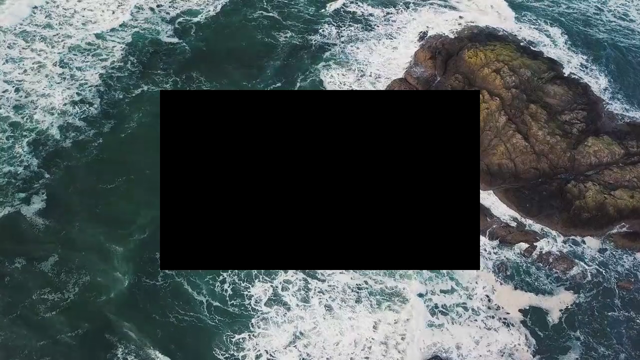
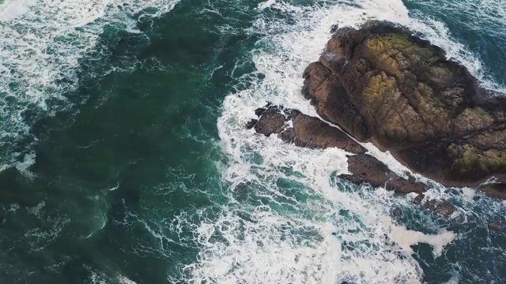
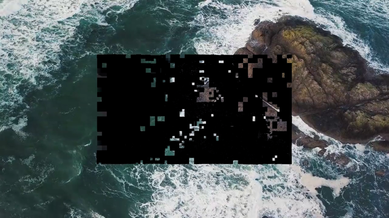

# Island-only proving: problem statement and solution space

**Goal:** Eva today folds **every macroblock of the clip** through Nova. We want to fold only the
**island `I`** around an edit (~2% of slots) and copy the rest from the signed capture. This
document states why that is hard, what we measured, which approaches are dead ends, and what
still has to be built or proved.

Companion material: [`docs/island-only-explained.md`](island-only-explained.md) (**start here** —
first-principles explanation, architecture diagrams, full cost comparison vs Eva today),
[`docs/glue-neighbor-experiments.md`](glue-neighbor-experiments.md) (protocol +
experiment index), [`docs/720p-edit-walkthrough.md`](720p-edit-walkthrough.md) (single scenario end
to end), and the `720p-edit-walkthrough` / `encoder-syntax-concepts` canvases.

---

## 0. Take

Three opinions, stated plainly, because they change what we should work on next.

**The smear question is settled; stop tuning the encoder.** We now have six JM presets × two box
geometries measured on 720p. Every full-clip re-encode configuration lands between **61k and 80k**
syntax-changed-without-pixel-edit slots out of 108,000. Encoder knobs move that by tens of percent,
never by orders of magnitude. The one configuration that does collapse it — per-frame independent
encode, ~3.4k — is not a usable production mode. Further sweeps have low marginal value.

**The real risk moved.** It is no longer "how much does re-encode smear" but "**is the spliced
bitstream correct, and is the copy path proved**". Those are different questions and we have not
measured either.

**The halo question has a first answer.** The splice-decode spike now compares decoded
planes **to each other** (not to source YUV — JM at QP 30 is lossy, so pixel-oracle error ~239
outside `I` is compression noise). With `pred + dequant(coeff)` decode on frame 14:

| compare | outside_i_max | island_max |
|---|---:|---:|
| spliced vs full_orig (halo 0–2, naive) | **0** | 255 |
| spliced vs full_edited (halo 0–2, naive) | 255 | **0** |

Copy-`J` **syntax merge** is exact for geometric `I` on edited frames (step A), but post-window P
slots in the MV closure cannot keep orig syntax once island recon diverges — see step B below.

**P-MV closure dominates halo.** Geometric `I` is ~2,100 MBs (1.94%).
Following L0 MV reachability on the capture (orig) JM dump expands `I` to **~18,000–22,000**
MBs (**17–20%** of the clip) for the mid-clip 720p edit, almost all on **post-edit P frames**
(frames 16–29). Only ~40 MBs outside the halo on edited frames join via MV; the rest is transitive
P-chain leak after the edit window. ffmpeg `gop_post` decode counts were ~0 because they measure
pixel drift under full re-encode, not “which skip slots must not copy orig syntax.”

---

## 1. What Eva does today, and what we want

| | Today | Target |
|---|---|---|
| Nova walks | Every MB slot in the clip | Island `I` only |
| 720p / 30f example | 108,000 slots | ~2,100 slots (**1.94%**) |
| Skip slots | Also folded | Copied from capture, never folded |
| Capture commitment | Running hash over whole clip | Merkle roots `R_pix`, `R_syn` (leaf per MB) |

The move from "running hash over everything" to "Merkle tree with a leaf per MB" is what makes
island-only possible at all: a tree still has a leaf for a macroblock Nova never visits, so the
camera signature keeps meaning. That part is implemented (`video/src/merkle.rs`, SHA3-256 with
`pix` / `syn` / `node` domain separation).

---

## 2. Why you cannot just re-encode the edited clip

The naive alternative to splicing is: apply the edit, re-encode the whole clip, publish that. It
fails for a reason that is easy to state and was worth measuring precisely.

A lossy encoder does not reproduce its own output. Re-encoding re-runs rate–distortion
optimization, so it picks new modes, motion vectors, and quantized coefficients **even for
macroblocks whose input pixels are byte-identical**. The published file then disagrees with the
signed capture syntax almost everywhere, and there is nothing left to copy.

Measured on the 720p fixture (centered 640×360 redact on frames 14–15, 108,000 MB slots total):

| Layer | Slots changed with **no** pixel edit |
|---|---|
| Pixels before encode | **0** outside island `I` — the edit is strictly local |
| JM syntax after full re-encode | **63,000–80,000** depending on preset |
| ffmpeg decoded luma (proxy) | 382 (GOP=1), 32 (GOP=8) |

The gap between the syntax number and the decode number is the important one. Decode diff asks "does
the picture look different"; syntax diff asks "did the encoder's internal representation change".
Only the second matches what Eva proves, and it is two orders of magnitude larger.

---

## 3. Encoder knobs: measured, and they do not rescue full re-encode

`video/examples/jm_syntax_sweep.rs` → [`docs/results/jm-syntax-sweep-720p.csv`](results/jm-syntax-sweep-720p.csv).

| JM preset | Box | Syntax no-pixel | Outside `I` | On f14–15 only |
|---|---|---|---|---|
| IPP baseline | center | 77,130 | 76,874 | 5,122 |
| IPP baseline | MB-aligned | 63,235 | 62,997 | 4,860 |
| All-intra | center | 77,791 | 77,544 | 4,990 |
| All-intra | MB-aligned | 80,011 | 79,764 | 4,991 |
| GOP=8 | center | 61,295 | 61,060 | 4,680 |
| GOP=8 | MB-aligned | 62,200 | 61,958 | 4,871 |
| Constrained intra | center | 69,590 | 69,330 | 5,337 |
| Constrained intra | MB-aligned | 67,118 | 66,858 | 5,319 |
| Strict CQP | center | 71,389 | 71,129 | 5,242 |
| Strict CQP | MB-aligned | 71,584 | 71,343 | 4,902 |
| **Per-frame independent** | center | **3,426** | 3,271 | 3,426 |
| **Per-frame independent** | MB-aligned | **3,422** | 3,267 | 3,422 |

Reference decode columns (ffmpeg libx264, same for all JM presets): GOP=1 → 382 / 394, GOP=8 →
32 / 34 for center / MB-aligned respectively.

Reading of the table:

- **GOP, all-intra, constrained intra, strict CQP** stay in the same order of magnitude. None is a
  solution.
- **Per-frame independent encode** — each frame encoded as its own one-frame clip, dumps
  concatenated — drops smear ~20× and confines all of it to the edited frames. That isolates the
  cause: most smear is *cross-frame coupling* (reference chain, picture-level QP search), and the
  ~3.4k residue is within-frame RDO on the frames we actually touched.
- **MB-aligned redaction** (snap the box outward to the 16×16 grid so no macroblock is half-painted)
  changes almost nothing in the regime that matters: 3,426 → 3,422 under independent encode. It is
  worth doing for clean geometry and privacy, not as a smear control.

### Why independent encode is not a product option

It answered a diagnostic question well and should stay in the repo as such, but it cannot ship:

- Skip tiles still get **fresh** syntax, not the camera's bytes — so there is still nothing to copy
  and nothing tied to the signature.
- Thirty separate one-frame encodes are not the same stream as one IPP clip (different reference
  structure, slice types, NAL layout). You cannot reassemble them into the file the camera would
  have produced.
- Even at 3,422 it is still worse than the splice target, which re-encodes ~2,100 slots *by
  construction* and zero outside them.

### Reproducibility caveat

The same preset and box has produced **72,438** and **77,130** on two runs of the sweep, with the
edited-frame subtotal nearly identical (5,117 vs 5,122) and the difference concentrated on frames we
never touched. The walkthrough export reports **73,189** for the comparable configuration. The
qualitative conclusion is unaffected — it is tens of thousands either way — but **do not quote an
exact figure** until the source of run-to-run variance (dump truncation between runs, JM build
state, or genuine encoder nondeterminism) is pinned down. Tracking item in §7.

---

## 4. The approach that works: copy `J`, re-encode `I`, splice

| Region | Pixels | Syntax in published file | Slots (720p example) |
|---|---|---|---|
| Gadget `G` | Painted | **New**, from Nova | 1,840 |
| Halo `H` | Unchanged | **New**, from Nova | 260 |
| Skip `J` | Unchanged | **Copied verbatim from capture** | 105,900 |

The distinction that caused most confusion in discussion is worth stating explicitly: skip is chosen
by **geometry**, decided before any encoding, not by observing which macroblocks a re-encode
happened to change. Glue never runs the encoder on `J` at all, so the 72k figure simply does not
arise for those slots.

Halo exists because copied syntax cannot sit directly against new gadget syntax. Intra prediction
and deblocking read reconstructed neighbors; a macroblock bordering the black box has unchanged
pixels but a changed neighborhood, so its captured syntax is no longer the right description of it.
The ring is the compatibility buffer between "re-encoded" and "copied".

### How the published file is assembled

```
for each MB slot j in encoder scan order:
    syntax[j] ← S′_j   if j ∈ I     (new, from Nova forward-encode)
    syntax[j] ← S_j    if j ∈ J     (copied capture fields)

CABAC(syntax[...]) → NAL units → edited.mp4
```

Two properties of this that answer the "surely they are incompatible" objection:

1. What gets merged is **structured syntax fields** (predictor, quantized coefficients, MB type, QP),
   not MP4 bytes. Merging happens before entropy coding.
2. The merged list is entropy-coded in **one CABAC pass** per slice. You cannot memcpy the original
   file and patch bytes, because CABAC context at slot *j* depends on everything decoded before it.

So old and new syntax do coexist in one file — but as a planned slot-by-slot assembly followed by a
single re-encode of the entropy layer, not as two independently produced fragments stapled together.

---

## 5. Constraints this introduces

Full re-encode has one requirement: run the encoder. Splicing has many. They are the price of
keeping 98% of the capture syntax.

**Geometry**

- `I ⊇ gadget ∪ Chebyshev halo` on edited frames.
- `I` must additionally absorb any macroblock whose **inter prediction** reads an edited picture
  (P-MV closure). Not yet implemented or measured.
- Edit rectangle and frame window are fixed at prove time; they define `I`.

**Capture side**

- Per-MB **picture** leaves → `R_pix`; per-MB **syntax** leaves → `R_syn`; signature over both.
- Syntax must be retained as **named fields**, not only as muxed bitstream, so it can be re-CABAC'd.
- Leaf hashing includes the index, so tiles cannot be permuted.

**Prover / Nova**

- Forward-encode only `I`; original island pictures are Merkle-opened against `R_pix` in-circuit.
- Predictor and QP enter as **witnesses** consistent with the splice layout — the circuit does not
  rebuild intra prediction from reconstructed neighbors.
- Island syntax parsed back out of `edited.mp4` must equal what the proof folded into `h2_I`.

**File assembly ("CABAC glue")**

- Every slot assigned exactly once, copy or replace; no gaps.
- One CABAC pass per slice; legal NAL and container structure.

**Verifier**

- Check σ over `(R_pix, R_syn)` first.
- Per skip slot: syntax opens to `R_syn`, and the **published original** picture opens to `R_pix`
  — not pixels decoded from the edited file.
- Per island slot: SNARK verifies and file-parsed syntax matches `h2_I`.

---

## 6. Known gaps, ranked by risk

**1. Splice validity is partially tested.** The repo merges per-slot JM syntax
(`merge_syntax`: copy `J`, replace `I`) and decodes frame 14 (`docs/results/splice-decode-720p.csv`).
**Naive decode:** `spliced vs full_orig` outside `I` is **0** at all `halo_mbs ∈ {0,1,2}`; `spliced
vs full_edited` on `I` is **0**. Copy-`J` at the syntax-merge level is validated for this scenario.
Remaining gaps: scan-order intra recon, **CABAC glue**, and reference-decoder confirmation — P-MV
merge is wired (`merge_syntax_pmv` / `merge_for_publish`).

**2. P-MV closure is measured (720p orig dump).** `video/src/pmv_closure.rs` + `mv_enc` from JM
expand geometric `I` to **16.7% / 18.7% / 20.4%** of the clip for `halo_mbs` 0 / 1 / 2
(`docs/results/pmv-closure-720p.csv`). ~16k post-window MBs must not use blind copy-`J` syntax.
**Edit position** (same capture, `docs/results/pmv-closure-position-720p.csv`, halo=1):

| position | frames | post frames | closure % |
|---|---:|---:|---:|
| early | [2, 4) | 26 | **36.2%** |
| mid | [14, 16) | 14 | **18.7%** |
| late | [24, 26) | 4 | **6.0%** |

Mid-clip is not the worst case; early edits roughly **double** the Nova walk vs our default scenario.

**3. Skip `S ↔ P` is not proved.** The verifier opens skip syntax to `R_syn` and skip pixels to
`R_pix`, but two Merkle openings do not establish `Encode(P_j) = S_j`. A malicious capture could in
principle commit to a syntax leaf unrelated to its picture leaf.

**4. CABAC glue is unbuilt.** The merge-and-re-entropy-code step is designed but not implemented.
Until it exists there is no end-to-end artifact to test the first three items against.

**5. No whole-file integrity.** Integrity is per-tile over `I ∪ J`; there is no hash binding the
complete container.

---

## 7. Proposed next steps

Ordered by information gained per unit of work, not by size.

**A. Build a splice and decode it.** **Done (first pass).**
`merge_syntax` + `decode_frame_luma` in `video/src/syntax_splice.rs`; runner
`cargo run --release -p video --example splice_decode_spike -- --frame 14 --out docs/results/splice-decode-720p.csv`.

Frame 14, naive `pred + dequant(coeff)` decode — compare **decoded planes** (CSV column `compare_to`):

| compare_to | halo | outside_i_max | island_max |
|---|---:|---:|---:|
| full_orig (spliced ref) | 0–2 | **0** | 255 |
| full_edited (spliced ref) | 0–2 | 255 | **0** |
| pixel_oracle (spliced ref) | 0–2 | 239 | 255 |

`pixel_oracle` rows measure JM compression loss vs source YUV, not splice correctness. **Follow-up:**
P-MV closure (step B), CABAC glue (step D), reference H.264 decode for end-to-end confirmation.

**B. Measure P-MV closure.** **Done.** Closure measured + wired into merge.

`merge_syntax_pmv` / `merge_syntax_set` in `video/src/syntax_splice.rs` — replace edited syntax on
every slot in MV-expanded `I` (from **orig** `mv_enc`).

| halo_mbs | geometric | closure | added_post | closure % |
|---:|---:|---:|---:|---:|
| 0 | 1,840 | 18,018 | 16,140 | 16.7% |
| 1 | 2,100 | 20,197 | 18,057 | 18.7% |
| 2 | 2,376 | 22,085 | 19,667 | 20.4% |

Frame 16 splice spike (`docs/results/splice-pmv-720p.csv`) — **closure ∩ frame** MBs (~900–1150 on
frame 16), naive decode vs `full_edited`:

| merge | closure_frame_max |
|---|---:|
| geometric | **255** (still orig syntax on post closure) |
| pmv_closure | **0** (edited syntax on closure slots) |

**Follow-up:** CABAC glue (step D), reference H.264 decode end-to-end.

**C. Edit position vs closure.** **Done.** `pmv_closure_position` on orig 720p capture:

```bash
cargo run --release -p video --example pmv_closure_position -- \
  --out docs/results/pmv-closure-position-720p.csv
```

See table under §6 gap 2. Early `[2,4)` ≈ **2×** mid-clip closure; late `[24,26)` ≈ **⅓** of mid.

**D. Fix sweep reproducibility.** Determine why identical preset and box produced 72,438 and 77,130.
Check that `eva_dump_open` truncates rather than appends, clear dump directories between presets, and
run the same configuration three times to confirm determinism before any number goes in a paper.

**E. Prototype CABAC glue on one frame.** **Done through full 30f normal IPPP.**

Critical dump bug fixed: `mb_pred` is 16×16, was indexed with `pix_x` (OOB for most MBs).
Chroma sidecar `chroma_enc` (~4.4 KB/MB): chroma CBP, `c_ipred_mode`, `cofDC[1|2]`, `cofAC[4|5]`.
`luma_cof_enc` (~8.5 KB/MB): luma CBP/`cbp_blk`, `cofDC[0]`, raw `cofAC[0..3]` (needed for I8 8×8 + I16 DC).
P modes set `b8x8` (P16/P8x16/P8x8); PSKIP uses `FindSkipModeMotionVector`.
`mvd_enc` (64 B/MB) + `eva_glue_use_stored_mvd()` in `writeMotionVector8x8`.
I8 modes live at `intra_pred_modes8x8[0,4,8,12]` (not `[0..3]`).
Dump/glue QP must match (`--qp N` on both scripts).
Both scripts force `ReferenceReorder=0` and `UseDistortionReorder=0`: glue recon is
predictor-only, so distortion-based RPLM would rewrite slice headers from frame 2 onward.

| Check | Result |
|---|---|
| I4-only I-frame / IPPP 2f | **bitexact** |
| Normal I-frame (I4+I8+I16) | **bitexact** (157990 B) |
| Normal IPPP 2f / 8f / **30f** | **bitexact** (30f = 873856 B) |
| Merge→glue publish path | **Runs, but not faithful — see §7H** |

```bash
# Full 30f (dumps ~1.4 GB under docs/fixtures/glue-30f-normal — regenerate locally):
./scripts/jm_syntax_dumps.sh --yuv docs/fixtures/sample_720p_30f.yuv \
  --out docs/fixtures/glue-30f-normal --width 1280 --height 720 --frames 30 --qp 28
bash scripts/jm_glue_encode.sh --glue-dir docs/fixtures/glue-30f-normal \
  --yuv docs/fixtures/sample_720p_30f.yuv --out /tmp/glue-30f.264 --frames 30 --qp 28
```

See `docs/results/cabac-glue-720p.csv`. Every row there is an **identity round-trip**: dumps from
encode A glued back into a copy of encode A. §7H is the mixed case.

**H. Merge→glue publish (skip tiles from capture + island tiles from the edited encode).**
**Done. It runs end-to-end and it is not faithful.**

```bash
python3 scripts/eva_mixed_merge.py redact --yuv docs/fixtures/sample_720p_30f.yuv \
  --out /tmp/eva-mixed/edited-30f.yuv --frames 14 16 --box 320 180 640 360
./scripts/jm_syntax_dumps.sh --yuv /tmp/eva-mixed/edited-30f.yuv \
  --out /tmp/eva-mixed/dumps-edited --width 1280 --height 720 --frames 30 --qp 28
cargo run --release -p video --example island_slots_export -- \
  --dumps docs/fixtures/glue-30f-normal --mode pmv --halo 1 --out /tmp/eva-mixed/slots-pmv.txt
python3 scripts/eva_mixed_merge.py merge --orig docs/fixtures/glue-30f-normal \
  --edited /tmp/eva-mixed/dumps-edited --slots /tmp/eva-mixed/slots-pmv.txt \
  --out /tmp/eva-mixed/merged-pmv
bash scripts/jm_glue_encode.sh --glue-dir /tmp/eva-mixed/merged-pmv \
  --yuv /tmp/eva-mixed/edited-30f.yuv --out /tmp/eva-mixed/mixed-pmv.264 --frames 30 --qp 28
cargo run --release -p video --example mixed_publish_report -- \
  --cand /tmp/eva-mixed/dec/mixed-pmv.yuv --orig /tmp/eva-mixed/dec/orig.yuv \
  --edited /tmp/eva-mixed/dec/edited.yuv --slots /tmp/eva-mixed/slots-pmv.txt \
  --gadget-slots /tmp/eva-mixed/slots-gadget.txt --label pmv_closure_halo1 \
  --csv docs/results/mixed-publish-720p.csv
```

Merging is a per-slot byte choice across all nine sidecars, so it needs no new dump format.
Frames 0–13 of the orig and edited dumps are **byte-identical** in every sidecar — the encoder is
deterministic and the edit does not reach backwards. From frame 14 on, 900–1,800 of 3,600 MBs per
frame differ in `mb_type` alone.

Three things came out of it.

*It runs.* Every merge variant produces a standards-conformant Annex B stream that ffmpeg decodes
to 30 frames with no errors. Under P-MV closure the redaction is present and clean on frames 14–15
and absent from frame 16 on, which is what the edit specifies.

*The harness is sound.* Control merge = every MB on frames ≥ 14 taken from the edited dumps. Glue
output is **bitexact** against the edited encoder's own `source.264` (868,186 B). So the drift
measured below is real, not a splice bug.

*It is not faithful.* Fidelity target: every pixel outside the redact box should still be the
camera's decoded pixel. Columns are `nongadget_*` in `docs/results/mixed-publish-720p.csv`;
`vis` counts MBs whose worst luma sample is off by more than 16.

| variant | island MBs | f14 max / mean / vis | f24 max / mean / vis |
|---|---:|---|---|
| plain full re-encode (baseline) | — | 24 / 0.30 / 42 | 26 / 2.25 / 417 |
| control, all MBs from f14 | 57,600 | 24 / 0.30 / 42 | 26 / 2.25 / 417 |
| geometric halo 1 | 2,100 | 95 / 0.95 / 385 | 232 / **25.07** / 1381 |
| geometric halo 4 | 2,976 | 72 / 0.10 / 30 | 232 / 24.37 / 1030 |
| P-MV closure halo 1 | 20,602 | 95 / 0.95 / 385 | 173 / 3.52 / 1386 |
| P-MV closure halo 2 | 22,501 | 86 / 0.16 / 67 | 173 / 3.76 / 1439 |

Two independent error sources, and they behave differently.

**Intra-frame smear** shows up on frame 14, whose reference (frame 13) is identical in both encodes,
so nothing inter-frame can contribute. Halo sweep, frame 14 only:

| halo | 0 | 1 | 2 | 4 | 8 |
|---|---:|---:|---:|---:|---:|
| max | 135 | 95 | 86 | 72 | 65 |
| mean | 2.65 | 0.95 | 0.16 | 0.10 | 0.37 |
| MBs off by >16 | 756 | 385 | 67 | 30 | 115 |

Halo 4 is the optimum and it does not reach zero. Past halo 4 it gets *worse*: a larger island
imports more tiles from an encode whose reconstruction already drifts from the camera's, so halo
trades boundary error against imported re-encode smear.

**Inter-frame reference drift** dominates from frame 16 on and no halo or closure setting touches
it. Geometric merge is catastrophic (mean 25, ~1,300 visibly wrong MBs per frame — the black box
motion-compensates forward and shreds the rest of the clip). P-MV closure removes the visible
breakage but still lands at mean 3.5 with ~1,400 MBs per frame off by more than 16, against 2.25
and 417 for a plain re-encode.

Root cause: the island tiles were produced by an **independent** re-encode of the edited clip. Its
residuals were fitted to *its* reconstruction, which differs from the merged reconstruction
everywhere on frames ≥ 14. The decoder forms the predictor from the merged reconstruction and adds
a residual that belongs to a different predictor. Closure over the *capture's* motion field cannot
fix this: the condition it enforces is that no skip MB reads island pixels, but the violated
condition is that no island MB may read *non-island* pixels, and non-island pixels differ between
the two encodes on every post-edit frame. Closing that direction pulls in the whole frame, which is
exactly the control row.

The fix is architectural, not a bigger halo. Island syntax has to be produced by encoding **against
the merged reconstruction**: a hybrid encode where skip MBs inject camera syntax and reconstruct
properly, and island MBs run normal RDO on top of that reconstruction. That is `eva_glue.c` plus a
per-slot inject/encode switch plus real reconstruction for injected MBs (the glue path currently
reconstructs predictor-only, which is why `ReferenceReorder` had to be disabled in §7E). Until that
exists, "encode the edited clip separately and take the island tiles" is measured and does not work.

Frame 15 (redaction present) and frame 20 (redaction gone), P-MV closure merge:




Frame 20 under geometric merge, where the box leaks forward for the rest of the clip:



**F. Close `S ↔ P` for skip tiles.** Design work: either prove `Encode(P_j) = S_j` for skip slots
(expensive — that is the thing we are trying to avoid) or bind them at capture so the camera cannot
commit mismatched leaves. This is a protocol decision, not an experiment.

**G. Island cost reduction — low priority.** Smaller box, fewer edited frames, or `halo_mbs = 0`
shrink Nova work roughly linearly. Only worth tuning after (A) establishes what the minimum safe
halo actually is.

What is explicitly **not** worth more effort: additional JM encoder-knob presets, additional
redaction fill-colour variants aimed at reducing smear, and coefficient-matching schemes borrowed
from watermarking. The first two are measured and flat; the third solves the opposite problem
(surviving re-encode with an embedded payload) and cannot reproduce camera syntax for skip tiles,
which is already available by copying.

---

## 8. Code and data map

| Path | Role |
|---|---|
| `video/src/island.rs` | `IslandSpec`, roles, Chebyshev halo, `snap_outward_to_macroblocks` |
| `video/src/merkle.rs` | Capture trees, `pixel_leaf`, `syntax_leaf`, proofs |
| `video/src/keccak_r1cs.rs` | Bit-oriented Keccak-f[1600] R1CS (Boolean); SHA3 perm counts |
| `video/examples/hash_r1cs_cost.rs` | Griffin vs Keccak R1CS cost → `docs/results/hash-r1cs-cost.csv` |
| `docs/results/hash-r1cs-cost.csv` | Measured: Griffin permute 306; Keccak-f 155,200; SHA3 open 555× encode |
| `video/src/mb_grid.rs` | Per-MB report, walkthrough / grid JSON |
| `video/src/neighbor_impact.rs` | `compare_yuv_to_island`, `syntax_mb_changed` |
| `video/examples/jm_syntax_sweep.rs` | Preset × box sweep → CSV |
| `scripts/jm_syntax_dumps.sh` | JM build/patch + syntax dumps; GOP, intra, CQP, independent-frame knobs |
| `third_party/jm-eva/eva_dump.c` | JM hook: pred/coeff/type/mv/intra_modes/b8x8/**chroma_enc** |
| `third_party/jm-eva/eva_glue.c` | JM CABAC glue: inject merged syntax → `write_macroblock` |
| `scripts/jm_glue_encode.sh` | Glue encode with `EVA_GLUE_DIR`; `--i4-only` |
| `docs/fixtures/glue-2f-i4/` | 2-frame I4 dump (+ `mvd_enc`) + `source.264`; bitexact glue |
| `docs/fixtures/glue-1f-normal/` | 1-frame normal (I4/I8/I16) dump + `luma_cof_enc`; bitexact |
| `docs/fixtures/glue-2f-normal/` | 2-frame normal IPPP dump; bitexact glue |
| `docs/fixtures/glue-8f-normal/` | 8-frame normal IPPP; bitexact (local) |
| `docs/fixtures/glue-30f-normal/` | 30-frame normal IPPP (~1.4 GB dumps); bitexact (local, gitignored) |
| `scripts/eva_mixed_merge.py` | Redact a YUV; per-MB splice of orig/edited sidecars (§7H) |
| `video/examples/island_slots_export.rs` | Island / P-MV closure MB index list for the splice |
| `video/examples/mixed_publish_report.rs` | Score a mixed bitstream vs capture and vs full re-encode |
| `docs/results/mixed-publish-720p.csv` | Mixed publish fidelity, all merge variants (§7H) |
| `video/examples/cabac_glue_spike.rs` | I-frame glue vs normal encode check |
| `video/examples/glue_frame_cmp.rs` | ffmpeg vs dump-naive / ref bitstream |
| `video/src/pmv_closure.rs` | P-MV transitive closure from `mv_enc` |
| `video/examples/pmv_closure_report.rs` | Halo sweep → `docs/results/pmv-closure-720p.csv` |
| `video/examples/pmv_closure_position.rs` | Early/mid/late edit → `pmv-closure-position-720p.csv` |
| `docs/results/pmv-closure-position-720p.csv` | Closure vs edit position (§7C) |
| `docs/results/jm-syntax-sweep-720p.csv` | Sweep results (§3) |
| `docs/results/mb-walkthrough-720p-intra-syntax.json` | Per-MB lists for the 720p scenario |
| `video/src/syntax_splice.rs` | Merge JM dumps; `merge_syntax_pmv`, decode spike |
| `video/examples/splice_pmv_spike.rs` | Geometric vs P-MV merge on post frame → `splice-pmv-720p.csv` |
| `docs/results/splice-pmv-720p.csv` | Post-frame merge comparison (§7B) |
| `video/examples/splice_decode_spike.rs` | Halo sweep → `docs/results/splice-decode-720p.csv` |
| `docs/results/splice-decode-720p.csv` | Splice-decode spike (§7A) |

Reproduce P-MV closure (requires `mv_enc` in dump dir):

```bash
./scripts/fetch_fixture_720p.sh
./scripts/jm_syntax_dumps.sh --yuv docs/fixtures/sample_720p_30f.yuv \
  --out docs/fixtures/jm-dumps-720p/orig --width 1280 --height 720 --frames 30
cargo run --release -p video --example pmv_closure_report -- \
  --out docs/results/pmv-closure-720p.csv
cargo run --release -p video --example splice_pmv_spike -- \
  --frame 16 --out docs/results/splice-pmv-720p.csv
cargo run --release -p video --example pmv_closure_position -- \
  --out docs/results/pmv-closure-position-720p.csv
```

Reproduce CABAC glue spike (I4-only I-frame; luma max=0 vs normal encode):

```bash
dd if=docs/fixtures/sample_720p_30f.yuv of=/tmp/frame0.yuv bs=$((1280*720*3/2)) count=1
./scripts/jm_syntax_dumps.sh --yuv /tmp/frame0.yuv --out docs/fixtures/glue-frame0 \
  --width 1280 --height 720 --frames 1 --all-intra --i4-only
cargo run --release -p video --example cabac_glue_spike -- \
  --out docs/results/cabac-glue-720p.csv
```

Reproduce the splice spike (uses `docs/fixtures/jm-dumps-720p/{orig,edited}/`):

```bash
./scripts/fetch_fixture_720p.sh
cargo run --release -p video --example splice_decode_spike -- \
  --frame 14 --out docs/results/splice-decode-720p.csv
```

Reproduce the sweep:

```bash
./scripts/fetch_fixture_720p.sh
cargo run --release -p video --example jm_syntax_sweep -- \
  --out docs/results/jm-syntax-sweep-720p.csv
```

Runtime is roughly 15 minutes; the independent-frames preset alone is 60 JM invocations per box
variant.
